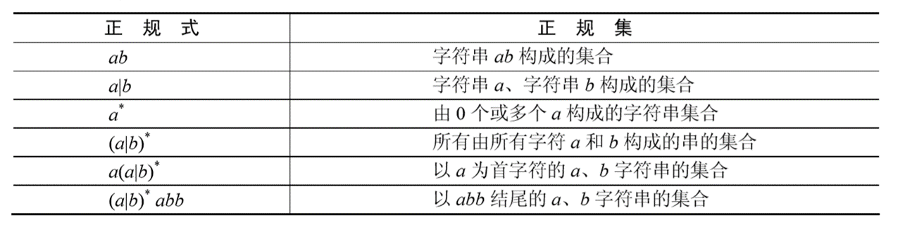

# 二、语言处理程序基础

语言处理程序是一类系统软件的总称，主要作用是将高级语言或汇编语言编写的程序翻译成某种机器语言程序，使程序在计算机上运行。
主要有**汇编程序、编译程序、解释程序**3种基本类型

## 2.1 汇编程序基础

### 2.1.1 汇编语言

汇编语言使为特定计算机设计的面向机器的符号化程序设计语言。
计算机不能直接识别和运行符号语言程序，所以要用专门的汇编程序进行翻译。

汇编语言源程序有若干条语句组成，一个程序种可以有三类语句：
**指令语句、伪指令语句、宏指令语句** 

1. 指令语句。指令语句又称机器指令语句，将其汇编后能产生相应的机器代码，
   这些代码能够被CPU直接识别并执行相应的操作。指令语句可以分为**传送指令、
   算术运算指令、逻辑运算指令、移位指令、转移指令、处理机控制指令**等。

2. 伪指令语句。指示汇编程序在汇编程序完成时某些工作；
   例如给变量分配存储单元地址，给某个符号赋一个值等。 
   **伪指令语句经汇编后不产生机器代码，指令语句汇编后产生相应的机器代码** 。
   伪指令在汇编时完成，指令在程序运行时执行

3. 宏指令语句。在汇编语言中，允许用户将多次重复使用的程序段定义为宏，
   每个宏有对应的宏名。在程序的任意位置，使用宏名就相当于使用了这段程序。 
   **宏指令语句就是宏的引用** 

### 2.1.2 汇编程序

汇编程序是将汇编语言编写的源程序翻译成机器指令程序。它的基本工作包括：
1.  **将每条可执行汇编语句转换成对应的机器指令** 
2.  **处理源程序种出现的伪指令和宏指令** 

由于汇编指令中形成操作数地址的部分可能在后面才能确定，
所以汇编程序一般要扫描两次源程序才能完成翻译工作。

* 第一次扫描的主要工作是 

    1. **定义符号的值并创建一个符号表S** T(记录汇编时遇到的符号的名和值)。此外，还有一个固定的机器指令表MOT1，记录每条机器指令的记忆码和指令的长度。

        在汇编程序翻译源程序的过程中，为了计算各汇编语句中标号的地址，需要设立一个位置计数器或单元地址计数器LC(初始值一般为0)。在扫描源程序时，没处理完一条机器指令或与存储分配有关的伪指令(定义常数语句、定义存储语句)，LC的值就增加相应的长度。

    2. **对与定义符号值有关伪指令进行处理**。设立伪指令表POT1(表中的每一个元素有两个值：伪指令助记符和相应的子程序入口)。

    第一次扫描源程序的过程
    ```
    1. 单元计算器LC置初值0
    2. 打开源程序
    3. 从源程序中读入第一条语句
    4. while(当前语句不是结束语句){
        if(当前语句有标号)： 将标号和单元计数器LC的当前值填入符号表ST;
        if(当前语句为可执行的汇编指令语句)：查找MOT1表获得当前指令的长度K，并令LC=LC+K;
        if(当前指令为伪指令)：查找POT1表并调用相应的子程序;
        if(当前指令的操作码时非法记忆码)：调用出错处理子程序;
        从源程序中读入下一条语句;
            
    }
    
    5. 关闭源程序
    ```
    
* 第二次扫描的主要任务

    1. 产生目标程序。使用前一次扫描产生的符号表ST，和机器指令表MOT2(机器指令助记符、机器指令的二进制操作码、格式、长度等)。另外还要设立一个伪指令表POT2(伪指令记忆码和相应的子程序入口)，供第二次扫描时使用

    2. 第二次扫描时，可执行汇编语句被翻译成二进制机器指令。有两方面工作：一是把机器指令助记符转换成二进制机器指令操作码。二是求出操作数区各操作数的值(二进制表示)。在此基础上，可以装配出用二进制代码表示的机器指令。

## 2.2 编译程序基础

### 2.2.1 编译过程概述

编译程序时把某高级程序书写的源程序翻译成与之等价的目标程序
(汇编语程序或机器语言程序)。编译程序的工作过程可分为6个阶段，如下图。
实际编译器中可能将其中某些阶段结合在一起进行处理。


1. 词法分析

   **对源程序从前到后(从左到右)逐个字符地扫描，从中识别出一个个“单词”符号** 
   。源程序可以视为一个多行的字符串。“单词”符号是程序设计语言的基本语法单位，
   例如关键字(保留字)、标识符、常数、运算符、分隔符(标点符号、左右括号)等。 
   **词法分析程序输出的“单词”常以二元组方式输出(`单词种类，单词自身的值`)** 

2. 语法分析

    **在词法分析的基础上，根据语言的语法规则将单词符号序列分解成各种类语法单位**，
   如“表达式”“语句”“程序”等。语法规则是各类语法单位构成规则，
   通过语法分析确定整个输入串是否构成一个语法上正确的程序。

   源程序没有语法错误，经过语法分析后，就能够正确地构造出语法树；
   否则给出相应地错误信息。

**词法分析和语法分析都是对源程序地结构进行分析**

3. 语义分析

   **主要分析程序中各种语法结构的语义信息，包括检查源程序是否包含静态语义错误，
   收集类型信息供后面的代码生成阶段使用**。

   主要工作是**进行类型分析和检查**。数据类型一般包含两个方面的内容：
   **类型的载体及类型支持的运算**。

4. 中间代码生成

   根据语义分析的输出生成中间代码。“中间代码”是一种简单且含义明确的记号系统；
   有若干种形式，它们共同特征是与具体的机器无关。中间代码的设计原则是
   **容易生成、容易被翻译成目标代码**，常用是与三地址码相似的四元式

    `运算符, 运算对象1, 运算对象2, 运算结果`


5. 代码优化

   由于编译器将源程序翻译为中间代码是机械化的、固定模式进行的，
   因此，生成的中间代码往往会造成计算机资源浪费。必须要对其进行优化，
   才能生成高效的目标代码。

   优化过程可以在中间代码生成阶段进行，也可以在目标代码生成阶段进行。
   由于中间代码是不依赖具体的计算机，所以 
   **优化一般建立在对程序的控制流和数据流分析的基础之上** 。

   **优化依据等价变换规则** 。

6. 目标代码生成

   编译器工作的最后阶段，任务是把中间代码变换成特定机器上的绝对指令代码、
   可重定位的指令代码或汇编指令代码，**与具体的机器密切相关**

7. 符号表管理

   记录源程序各个符号的必要信息，以辅助语义的正确性检查和代码生成，
   在编译过程种需要对符号表进行快速有效的查找、插入、修改和删除等操作。

8. 出错处理

   错误可大致分为静态错误和动态错误，动态错误也称动态语义错误，
   发生在程序运行时。静态错误指编译时发现的程序错误，
   可分为语法错误和静态语义错误。

   编译时发现程序错误后，编译程序应采取适当的逻辑策略修改，
   使得分析过程继续以便于一次编译找出尽可能多的错误。

编译的各个阶段可以在中间代码处分为前端和后端两个部分。
中间代码把编译器分成了与机器有关和与机器无关的两个部分

### 2.2.2 词法分析
词法分析过程的本质是**对构成源程序的字符串进行分析**，
是一种对象为字符串的运算。语言中具有独立含义的小语法单位是符号（单词），
如标识符、无符号常数与界限符等。词法分析的任务是**把构成源程序的字符串转换成单词符号序列。**
1. 字母表、字符串、字符串集合及运算
    * 字母表$\Sigma$: 元素的非空有穷集合
    * 字符: 字母表$\Sigma$中的一个元素
    * 字符穿: 字母表$\Sigma$中的一个序列
    * 字符串长度: 字符串中字符个数
    * 空串$\varepsilon$: 字符个数为0的字符串
    * 连接$\bullet$: 将两个字符串S和T连接起来
    * 空集$\Phi$
    * $\Sigma^{\ast}$: 字母表$\Sigma$上包括空串在内的字符串集合
    * 字符串的幂: 字符串本身连接n次
    * 字符串集合运算: 设A,B代表字母表$\Sigma$上的两个字符串集合
        * 或(并): $A\bigcup B=\{\alpha|\alpha \in A或者\alpha \in B\}$
        * 积(连接): $A\bigcap B=\{\alpha|\alpha \in A且\alpha|\alpha \in B\}$
        * 幂: $A^n=A\cdot A^{n-1}$
        * 正则闭包+:$A^{+}=A^1 \bigcup A^2 \bigcup A^3 \cdots$
        * 闭包*:$A^{*}=A^0\bigcup A^{+}$
    
2. 正规表达式

   运算符“`|`”、“`·` ”、“`*`”分别
   称为 “或”、 “连接” 、 “闭包”。在正规式的书写中，
   连接运算符“`·` ”可省略。运算符的优先级从高到低顺序排列为“`*`”、“`·`”、“`｜`”
   
       


3. 有限自动机 
   有限自动机是一种识别装置的抽象概念，它能准确地识别正规集。
   有限自动机分为两类：**确定的有限自动机和不确定的有限自动机**。
   * 确定的有限自动机（Deterministic Finite Automata，DFA）。
   * 不确定的有限自动机（Nondeterministic Finite Automata，NFA）

### 2.2.3 语法分析
程序设计语言的语法常采用上下文无关文法描述。
文法不仅规定了单词如何组成句子，而且刻画了句子的组成结构。
形式文法是一个规则（或称产生式）系统，它规定了单词在句子中的位置和顺序，
也描述了句子的层次结构。


## 2.3 解释程序
解释程序是另一种语言处理程序，在词法、语法和语义分析方面与编译程序的工作原理基本相同，
但是在运行用户程序时，它直接执行源程序或源程序的内部形式。
因此，解释程序不产生源程序的目标程序，这是它和编译程序的主要区别

对于高级语言的编译和解释翻译方式，可从以下几个方面进行比较。
* **效率**。**编译比解释方式可能取得更高的效率**。一般情况下，在解释方式下运行程序时， 
  解释程序可能需要反复扫描源程序。例如，每一次引用变量都要进行类型检查，
  甚至需要重新进行存储分配，从而降低了程序的运行速度。
  在空间上，以解释式运行程序需要更多的内存，因为系统不但需要为用户程序分配运行空间，
  而且要为解释程序及其支撑系统分配空间。

  在编译方式下，编译程序要生成源程序的目标代码并进行优化，
  该过程比解释方式需要更多的时间。虽然与仔细写出的机器程序相比，
  一般由编译程序创建的目标程序运行的时间更长，需要占用的存储空间更多，
  但源程序只需要被编译程序翻译一次，就可以多次运行。因此总体来讲，
  编译方式比解释方式可能取得更高的效率

* **灵活性**。**由于解释程序需要反复检查源程序，这也使得解释方式能够比编译方式更灵活**。
  当解释器直接运行源程序时，“在运行中”修改程序就成为可能，如增加语句或者修改错误等。
  另外，当解释器直接在源程序上工作时，它可以对错误进行更精确地定位

* **可移植性**。源程序是由解释器控制来运行的，可以提前将解释器安装在不同的机器上，
  从而使得在新环境下无须修改源程序使之运行。而编译方式下则需要针对新机器重新生成源程
  序的目标代码才能运行。由于编译方式和解释方式各有特点，
  因此现有的一些编译系统既提供编译的方式，也提供解释的方式，
  甚至将两种方式结合在一起。例如，在 Java 虚拟机上发展的一种 
  `compiling-just-in-time` 技术，就是当一段代码第一次运行时进行编译，
  其后运行时就不再进行编译了。


