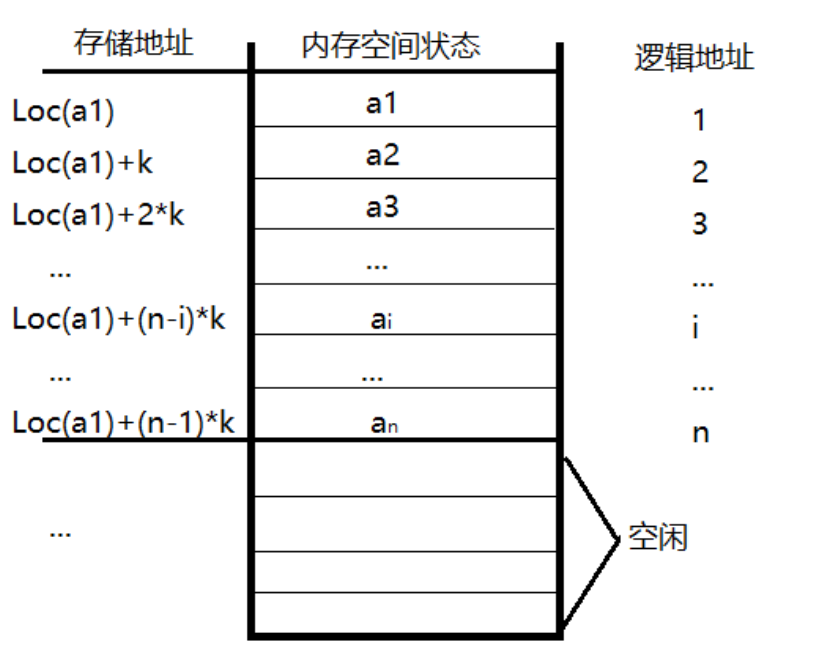

# 线性表

线性表(linear list)是具有相同特性的数据元素的有限序列
* 线性表中元素个数称为线性表长度$n$
* $n=0$表示空表
* 每个元素有逻辑序号唯一确定

## 一 线性表的抽象数据类型
```
ADT List
{
    数据对象:
        Data
    数据关系:
        Relation
    基本运算:
        InitList(**L): 初始化线性表，构造一个空的线性表L
        DestroyList(*L): 销毁线性表
        ListEmpty(*L): 判断线性表是否为空表
        ListLength(*L): 求线性表的长度
        DispList(*L): 输出线性表
        GetElem(*L, i, *e): 获取线性表中某个数据元素值
        LocateElem(*L,e): 查找元素e在线性表L中的索引
        ListInsert(*L, i, e): 在索引为i的位置，插入数据元素
        ListDelete(*L, i, *e): 删除索引为i数据元素，并返回
}
```

## 二 顺序表
线性表的顺序存储结构实现称为顺序表。就是将逻辑结构上相邻元素在物理结构上也相邻。



**顺序表基本实现**
```c
//
// Created by dyp on 2021/4/22.
//

#include <stdio.h>
#include <stdlib.h>

#define MaxSize 50
// 顺序表的定义
typedef struct {
    int data[MaxSize];  // 顺序存放数据
    int length; // 顺序表长度
}SeqList;

void InitList(SeqList **L){
    /**
     * 初始化顺序表，创建空表
     */
    *L = (SeqList *) malloc(sizeof(SeqList));  // 分配空间
    (*L)->length = 0;  // 初始化长度为0
}

void CreateList(SeqList **L, int *a, int n) {
    /**
     * 创建顺序表，并添加初始值
     */

    *L = (SeqList *) malloc(sizeof(SeqList));  // 分配空间

    for (int i = 0; i < n; i++) {
        *((*L)->data + i) = *(a+i);
    }
    (*L)->length = n;
}

void DestroyList(SeqList **L) {
    /**
     * 销毁顺序表
     */
    free(*L);
    *L = NULL;
}

void DispList(SeqList *L) {
    /**
     * 输出顺序表
     */
    for (int i = 0; i < L->length; i++) {
        printf("%d\t", *(L->data+i));
    }
    printf("\n");
}

_Bool ListEmpty(SeqList *L) {
    /**
     * 判断顺序表是否为空
     */
    return L->length == 0;
}

_Bool GetElem(SeqList *L, int i, int *e) {
    /**
     * 求i对应的元素，使用e返回
     */
    if (i < 1 || i > L->length){
        return 0;
    }
    *e = L->data[i-1];
    return 1;
}

int LocateElem(SeqList *L, int e) {
    /**
     * 操作e的位置
     */

    int i = 0;
    while (i < L->length && L->data[i] != e) {
        i++;
    }
    if (i >= L->length){
        return 0;
    }
    return i + 1;
}

_Bool ListInsert(SeqList *L, int i, int e) {
    /**
     * 向顺序表L的索引为i的位置插入e
     */
    int j;
    if(i < 1 || i > L->length + 1|| L->length == MaxSize) {
        return 0;
    }
    i--;
    for(j=L->length; j > i; j--) {
        L->data[j] = L->data[j - 1];
    }
    L->data[i] = e;
    L->length++;
    return 1;
}

_Bool ListDelete(SeqList *L, int i, int *e) {
    /**
     * 删除索引为i的元素
     */

    int j;
    if (i < 1 || i > L->length) {
        return 0;
    }
    i--;
    *e = L->data[i];
    for(j=i; j < L->length-1; j++) {
        L->data[j] = L->data[j+1];
    }
    L->length--;
    return 1;

}

int main(){
    int a[]={1,2,3,4,5,6};
    SeqList *L = NULL;

    CreateList(&L, a, sizeof(a)/ sizeof(int));
    DispList(L);
    int e=0;
    GetElem(L, 2, &e);
    printf_s("%d\n",e);
    printf_s("%d\n", LocateElem(L, 3));
    ListInsert(L, 1, 0);
    DispList(L);
    ListDelete(L, 2, &e);
    printf_s("%d\n",e);
    return 0;
}
```
插入数据时，移动的元素与表长`length`与插入位置`i`有关。
平均要移动的次数为$\sum_{i=1}^{n+1}p_i(n-i+1)=\sum_{i=1}^{n+1}\frac{1}{n+1}(n-i+1)$
$=\frac{1}{n+1}\sum_{i=1}^{n+1}(n-i+1)=\frac{1}{n+1}\times \frac{n(n+1)}{2}=\frac{n}{2}$
插入数据的时间复杂度为$O(n)$

在删除数据时，删除位置和表长决定了要移动元素的个数。同插入数据一样$\sum_{i=1}^{n}p_i(n-i)=\frac{1}{n}\times\frac{n(n-1)}{2}=\frac{n-1}{2}$

## 三 单链表

链表是线性表的链式存储结构。逻辑上相邻的数据在物理上不一定相邻，使用指针执行链式节点的下一个节点。


$存储密度=\frac{节点中数据元素所占的存储量}{结点占用的存储量}$

**单链表实现**
```c
//
// Created by dyp on 2021/4/22.
//

#include <stdio.h>
#include <stdlib.h>

typedef _Bool bool;
// 单链表定义
typedef struct LNode {
    int data;
    struct LNode * next;
}LinkNode;

// 头插法创建链表
void CreateListF(LinkNode **L, int *a, int n) {
    /**
     * 头插法创建链表
     */

    LinkNode  * s;
    *L = (LinkNode *) malloc(sizeof(LinkNode));
    (*L)->next = NULL;
    for (int i = 0; i < n; i++) {
        s = (LinkNode *) malloc(sizeof(LinkNode));
        s->data = *(a+i);
        s->next = (*L)->next;
        (*L)->next =s;
    }
}

// 尾插法创建链表
void CreateListR(LinkNode **L, int *a, int n) {
    /**
     * 尾插法创建链表
     */

    LinkNode *s,*r;
    *L = (LinkNode *) malloc(sizeof(LinkNode));
    r = *L;
    for(int i = 0; i < n; i++) {
        s = (LinkNode *) malloc(sizeof(LinkNode));
        s->data= *(a + i);
        r->next = s;
        r = s;
    }
    r->next = NULL;
}

void InitList(LinkNode **L) {
    /**
     * 初始化空链表
     */

    *L = (LinkNode *) malloc(sizeof(LinkNode));
    (*L)->next = NULL;
}

void DestroyLink(LinkNode *L) {
    /**
     * 销毁链表
     */

    LinkNode  *pre = L, *p;
    p = L->next;

    while (p) {
        free(pre);
        pre = p;
        p = pre->next;
    }
    free(pre);
}

_Bool ListEmpty(LinkNode *L) {
    /**
     * 判断链表是否为空
     */

    return L->next == NULL;
}

int ListLength(LinkNode *L) {
    /**
     * 求链表的长度
     */

    int n = 0;
    LinkNode  *p = L;
    while (p->next !=NULL) {
        n++;
        p = p->next;
    }
    return n;
}

void DispList(LinkNode *L) {
    /**
     * 输出链表数据
     */

    LinkNode  * p = L->next;


    while (p) {
        printf_s("%d ", p->data);
        p = p->next;
    }
    printf_s("\n");
}

_Bool GetElem(LinkNode *L, int i, int *e) {
    /**
     * 获取索引为i的元素
     */

    int j = 0;
    LinkNode *p = L;
    if (i < 0) {
        return 0;
    }
    while(j < i && p!=NULL) {
        j++;
        p = p->next;
    }
    if (p == NULL) {
        return 0;
    }
     *e = p->data;
    return 1;
}

int LocateElem(LinkNode *L, int e) {
    /**
     * 获取元素e在链表中的索引
     */

    int i = 1;
    LinkNode  *p = L->next;
    while(p != NULL && p->data != e) {
        p = p->next;
        i++;
    }
    if (p == NULL) {
        return 0;
    }
    return i;
}

_Bool ListInsert(LinkNode *L, int i, int e) {
    /**
     * 向链表L中的索引为i的位置插入元素e
     */

    int j = 0;
    LinkNode  *p = L, *s;
    if(i < 0) return 0;
    while (j++ < i - 1 && p!=NULL) {
        p = p->next;
    }
    if (p == NULL) {
        return 0;
    }

    s = (LinkNode *) malloc(sizeof(LinkNode));
    s->data = e;
    s->next = p->next;
    p->next = s;
    return 1;
}

_Bool ListDelete(LinkNode *L, int i,int *e) {
    /**
     * 删除链表中索引为i的元素，并是哟e返回
     */

    int j = 0;
    LinkNode  *p = L, *q;
    if (i <= 0) return 0;
    while (j++ < i - 1 && p != NULL) {
        p = p->next;
    }
    if (p == NULL) {
        return 0;
    }
    q = p->next;
    if(q == NULL) {
        return 0;
    }
    *e = q->data;
    p->next = q->next;
    free(q);
    return 1;
}


int main() {
    LinkNode *L;
    int a[] = {1,2,3,4,5,6};
    CreateListF(&L, a, sizeof(a)/sizeof(int));
    DispList(L);
    ListInsert(L, 1, 20);
    DispList(L);
    int i = LocateElem(L, 20);
    printf_s("%d\n", i);
    int e = 0;
    ListDelete(L, 1, &e);
    printf_s("%d\n", e);
}
```
链表插入和删除算法的时间复杂度都是$O(n)$


