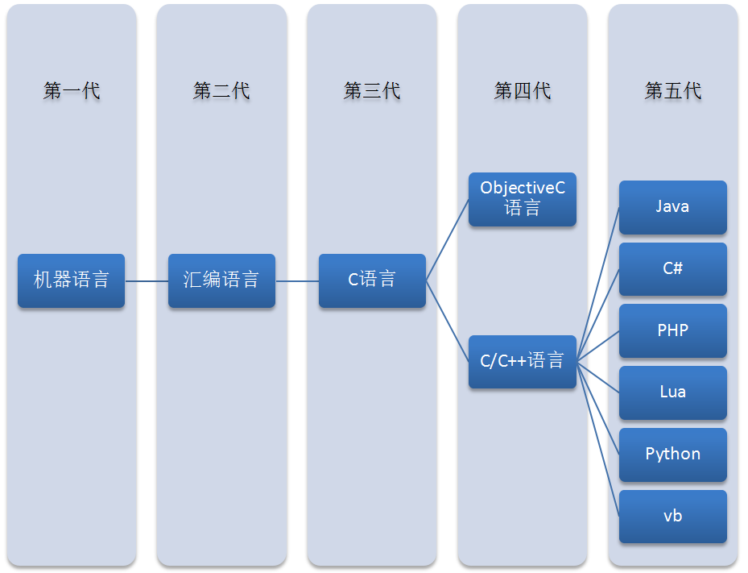
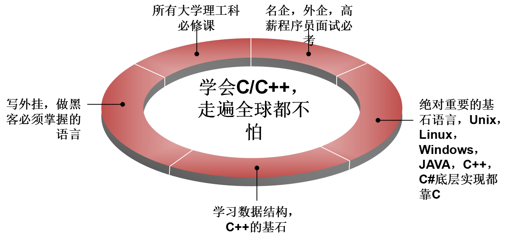

# 计算机相关基本知识及C语言简介

## 一、计算机相关基本知识

### 1.1 计算机的基本结构
现代计算机大多都采用冯.诺伊曼模型,如下图:

* 定义计算机的硬件组成部分
* 存储程序的思想：系统的运行过程就是按照一定的顺序不断的执行存储器中的指令。

#### 1.1.1 存储器的分类
* 主存储器即**内存**: 程序中**待处理**的数据和**处理后**的结果都**存储在内存中**。断电数据丢失
* 外部存储器: 用于长期保存数据的大容量存储器
* 寄存器: CPU中的高速存储器，速度快，容量小

### .。2、计算机系统

### 1.3、什么是程序?

广义上讲，为了实现某一个特定的目标而预先设计的一组可以操作的工作步骤，称为程序。

**程序**: 系统可以识别的一组有序指令。存储在磁盘上，被加载到内存中执行。

## 二、C语言简介
### 2.1 C语言起源
&emsp;&emsp;1972年，贝尔实验室的丹尼斯·里奇（Dennis Ritch）和肯·汤普逊（Ken
Thompson）在开发UNIX操作系统时设计了C语言。然而，C语言不完全是里
奇突发奇想而来，它是在B语言（汤普逊发明）的基础上进行设计。
C语言设计的初衷是将其作为程序员使用的一种编程工具，因此，其主要目标是成为有用的语言。

&emsp;&emsp;虽然绝大多数语言都以实用为目标，但是通常也会考虑其他方面。例
如，Pascal 的主要目标是为更好地学习编程原理提供扎实的基础；而BASIC
的主要目标是开发出类似英文的语言，让不熟悉计算机的学生轻松学习编
程。这些目标固然很重要，但是随着计算机的迅猛发展，它们已经不是主流
语言。然而，最初为程序员设计开发的C语言，现在已成为首选的编程语言
之一。

### 2.2、语言进化过程

### 2.3 C语言特点
1. 优点
  1. 代码量小
  2. 执行速度快
  3. 功能强大
  4. 编程自由

2. 缺点
  1. 写代码实现周期长
  2. 可移植性较差
  3. 过于自由，经验不足易出错
  4. 对平台库依赖较多

### 2.4 学C的理由

### 2.5 C语言应用领域

C语言的应用极其广泛，从网站后台，到底层操作系统，从多媒体应用到大型网络游戏，均可使用C语言来开发：
* C语言可以写网站后台程序
* C语言可以专门针对某个主题写出功能强大的程序库
* C语言可以写出大型游戏的引擎
* C语言可以写出另一个语言来
* C语言可以写操作系统和驱动程序，并且只能用C语言编写
* 任何设备只要配置了微处理器，就都支持C语言。从微波炉到手机，都是由C语言技术来推动的

