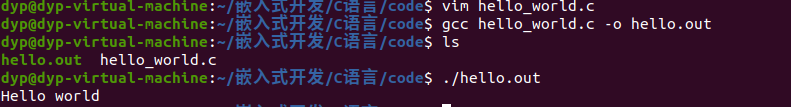
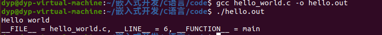

# 程序的编译

## 一、GCC编译器
gcc(GNU Compiler)是GNU推出的多平台编译器，可以将c、c++源程序编译链接成可执行文件。
支持后缀:
* .c      c语言源代码
* .h      程序所包含的头文件
* .i      已经预处理过的c语言源代码
* .s      汇编后的源代码
* .o      编译后的源代码

### 1.1 gcc编译过程
C代码编译成可执行程序经过4步：
1. 预处理：宏定义展开、头文件展开、条件编译等，同时将代码中的注释删除，这里并不会检查语法
  * 将头文件引入并展开，符号常量作基础替换。
2. 编译：检查语法，将预处理后文件编译生成汇编文件
3. 汇编：将汇编文件生成目标文件(二进制文件)
4. 链接：C语言写的程序是需要依赖各种库的，所以编译之后还需要把库链接到最终的可执行程序中去


### 1.2 gcc编译命令
#### 1.2.1 分步编译
1. 预处理：`gcc -E hello.c -o hello.i`
2. 编  译：`gcc -S hello.i -o hello.s`
3. 汇  编：`gcc -c hello.s -o hello.o`
4. 链  接：`gcc    hello.o -o hello`

**gcc命令选项**

|选项|含义|
|:---:|:---:|
|-E|只进行预处理|
|-S(大写)|只进行预处理和编译|
|-c(小写)|只进行预处理、编译和汇编|
|-o file|指定生成的输出文件名为 file|

**查看程序依赖的动态库命令: ldd(“l”为字母) 可执行程序**


## 二、第一次尝试编写C语言程序
在控制台输出"hello world"
```c
#include <stdio.h>
int main()
{
    printf("hello world");
    return 0;
}
```
使用vim编写程序后编译并执行后的结果



## 三、代码跟踪测试
利用包含在stdio.h `__FILE__`、`__LINE__`、`__FUNCTION__`可以实现代码跟踪
* `__FILE__`: 执行文件的源代码文件名
* `__LINE__`: 执行代码在的行数
* `__FUNCTION__`: 执行的函数名

```c
#include <stdio.h>
int main()
{
    printf("__FILE__ = %s, __LINE__ = %d, __FUNCTION__ = %s", __FILE__, __LINE__, __FUNCTION__);
    return 0;
}

```
使用vim编写后编译执行结果




## 四、程序

一个程序应当包含下面两个部分:
1. **对数据的描述。** 在程序中要指定数据类型和数据的组织形式，即数据结构
2. **对操作的描述。** 即操作步骤，也就是算法

### 4.1 算法的概念
解决问题采用的方法和步骤，称之为算法。


