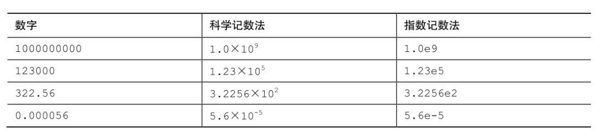

# 常量

在程序运行过程中**值不发生改变**的量叫常量。

**常量定义**:
`const 类型 常量名 = 值`
* `const` 只读修饰符

使用`const`修饰的常量不安全，可以通过指针修改。

* 对常量进行赋值时编译器会报错。

## 一、整型常量

对于整型常量，在C语言中通常可以是`十进制、八进制和十六进制`进行输入。

* 八进制: 在C语言中八进制数以数字`0`开头。
* 十六进制: 在C语言中十六进制以`0x`开头
* 二进制: C语言中不能赋值二进制数

**语法如下**:
`const [short] [int] [long] [long long] 常量名 = 值`

**值可以用十进制、八进制、十六进制数表示。**

## 二、浮点型常量

各种整数类型对大多数软件开发项目而言够用了。然而，面向金融和数学的程序经常使用浮点数。
C语言中的浮点类型有float、double类型。前面提到过，浮点类型能表示包括小数在内更大范围的数。
浮点数的表示类似于**科学记数法(即用小数乘以10的幂来表示数字)**。该记数系统常用于表示非常大或非常小的数。

**记数法示例**

* 第1列是一般记数法
* 第2列是科学记数法
* 第3列是指数记数法(或称为e记数法)这是科学记数法在计算机中的写法，e后面的数字代表10的指数。字母e不区分大小写

**注意: 不以f结尾的常量是double类型，以f结尾的常量(如3.14f)是float类型**

**语法如下**:
`const [float] [double] 常量名 = 值`

* 值可以采用上述记数法输入

## 三、字符常量

指一个单一字符，其表示为，由两个单引号包括的字符。

* 'A', 'a', '&', '?', '+', '\n', '0', 都是一个字符
在C语言中，字符常量具有数值。字符常量的值就是ASCII码的值。

**可以将字符常量看作一字节的正整数**

### 3.1 常用字符常量
|字符|ASCII值(十进制)|说明|
|:---:|:---:|:---:|
|A|65|大写相邻英文字母之间相差1|
|a|97|小写相邻英文字母之间相差1|
|' '|32|空格字符, 大写引文字母与小写英文字母之间相差一个空格字符，即相差32|
|'0'|48|字符零, `0~9`相邻两个数字之间相差1|

### 3.2 转义字符

|转义字符|作用|ASCII值(十进制)|
|:---:|:---:|:---:|
|'\a'|警报|007|
|'\b'|退格|008|
|'\f'|换页|012|
|'\n'|换行|010|
|'\r'|回车|013|
|'\t'|水平制表符|009|
|'\v'|垂直制表符|011|
||||
|'\\'|反斜线字符'\'|092|
|'\''|单引号(')字符|039|
|'\"'|双引号(")字符|034|
|'\?'|代表一个问号|063|
|'\0'|数字0|000|
||||
|'\ddd'|8进制转义字符，d范围0~7|3位8进制|
|'\xhhh'|16进制转义字符，h范围0~9，a~f，A~F|3位16进制|

## 四、字符串常量

一对双引号(")包括起来的一串字符的数据叫字符串。

* "hello world", "你好!", "9"," ", "+++"都是字符串

## 五、标识符常量

使用标识符代替常量使用的一种常量。名称通常是一个标识符。

**语法规则**:
`#define 标识符 值`

* 数据类型会根据标识符后的值，编译器会自动匹配。

**标识符的命名规则**
1. 由字母、数字、下划线组成
2. 数字不能作为开头
3. 不能是C语言的关键字, 也不能是引入头文件中存在的标识符
4. 标识符命名最好要有明确的意义。即: 见名知义

