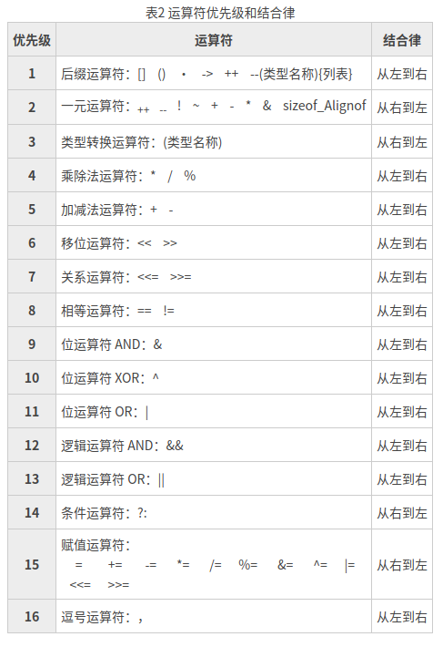

# 运算符

## 一、算术运算符

C语言提供如下算术运算符

|运算符|术语|说明|
|:---:|:---:|:---:|
|+|正号|单目运算符, 取正|
|-|负号|单目运算符，取负|
|+|加法|双目运算符, 求两个数的和|
|-|减号|双目运算符, 求两个数的差|
||||
|\*|乘法|双目运算符, 求两个数的积|
|/|除法|双目运算符, 求两个数的商|
|%|取余(模运算)|双目运算符, 求两个整数的余数|
||||
|++|自增1|单目运算符, 使用在变量前, 先自增在使用变量; 使用在变量后，先使用变量在自增|
|--|自减1|单目运算符, 使用在变量前, 先自减在使用变量; 使用在变量后，先使用变量在自减|

**注意:**
* 除法中, 整型与整型数据作除法时，得到结果还是整型数据。
* 取余运算, 对于浮点型数据不成立的; 浮点数不支持取余运算

## 二、比较运算符(关系运算符)
C语言的比较运算中， “真”用数字“1”来表示， “假”用数字“0”来表示

|运算符|术语|说明|
|:---:|:---:|:---:|
|>|大于|比较两个数值的大小, 例如a\>b, 如果数值a大于数值b, 返回真值; 否则返回假值|
|>=|大于或等于|比较两个数值的大小, 例如a\>=b, 如果数值a大于或等于数值b, 返回真值, 否则返回假值|
||||
|<|小于|比较两个数值的大小, 例如a\<b, 如果数值a小于数值b, 返回真值; 否则返回假值|
|<=|小于或等于|比较两个数值的大小, 例如a\<=b, 如果数值a小于或等于数值b, 返回真值; 否则返回假值|
||||
|==|等于|比较两个数值的大小, 例如a\==b, 如果数值a等于数值b, 返回真值; 否则返回假值|
|!=|不等于|比较两个数值的大小, 例如a\!=b, 如果数值a不等于数值b, 返回真值; 否则返回假值|

## 三、逻辑运算符

与数学中的逻辑运算符一致。

|运算符|术语|说明|
|:---:|:---:|:---:|
|!|逻辑非|单目运算符, 取反|
|&&|逻辑与|双目运算符, 同真为真, 一假则假; 短路特性-逢零截止, 遇到假值则后面的条件不进行判断|
|\|\||逻辑或|双目运算符, 同假则假, 一真则真; 短路特性-逢一截止, 遇到真值则后面的条件不进行判断|

## 四、位运算符

对数据的二进制进行对应位上的数进行运算

|运算符|术语|说明|
|:---:|:---:|:---:|
|`~`|按位逻辑非|单目运算符, 原码按位全部取反|
|`&`|按位逻辑与|双目运算符, 原码对应位同1取1, 其他取0|
|`|`|按位逻辑或|双目运算符, 原码对应位同0取0, 其他取1|
|`^`|按位逻辑异或|双目运算符, 原码对应位相同取0, 不同取1|
|`>>`|右移位|双目运算符, 原码向右移动n位;  抛弃低位, 高位补0|
|`<<`|左移位|双目运算符, 原码向左移动n位; 抛弃高位, 低位补0|

**位移动注意**:
* **语法**: `变量 = 位运算量 移位运算符 表达式`
  * 位运算量必须位**整型数值**
  * 移位运算符: 左移动(<<) 、右移动(>>)
  * 表达式的返回结果必须位**整型数值**

## 五、赋值运算符

"="赋值运算符，语法规则如下:
`变量名 = 表达式`
* **作用**: 将表达式的值赋值给变量。

### 5.1 赋值符合运算符
将其他的运算符与赋值运算符连用。

**语法规则如下**:
`变量名 其他运算符= 表达式`
* 将**变量名现在代表的数值**与**表达式的数值**进行**运算符规定的运算**，在将**运算后的值赋值给变量名**

|运算符|说明|示例|
|:---:|:---:|:---:|
|+=|加法赋值运算, 先执行加法, 在将得到的值赋值给变量|a += b \<==\> a = a + b|
|-=|减法赋值运算, 先执行减法, 在将得到的值赋值给变量|a -= b \<==\> a = a - b|
|\*=|乘法赋值运算, 先执行乘法, 在将得到的值赋值给变量|a \*= b \<==\> a = a \* b|
|/=|除法赋值运算, 先执行除法, 在将得到的值赋值给变量|a /= b \<==\> a = a / b|
|%=|取余赋值运算, 先执行取余, 在将得到的值赋值给变量|a %= b \<==\> a = a % b|
|&=|按位与赋值运算, 先执行按位与, 在将得到的值赋值给变量|a &= b \<==\> a = a & b|
|\|=|按位或赋值运算, 先执行按位或, 在将得到的值赋值给变量|a \|= b \<==\> a = a \| b|
|^=|按位异或赋值运算, 先执行按位异或, 在将得到的值赋值给变量|a ^= b \<==\> a = a ^ b|
|\<\<=|按位左移赋值运算, 先执行按位左移, 在将得到的值赋值给变量|a \<\< = b \<==\> a = a \<\< b|
|\>\>=|按位右移动赋值运算, 先执行按位右移, 在将得到的值赋值给变量|a \>\> = b \<==\> a = a \>\> b|

## 六、三目运算符

**条件运算符: "> :"**
* 是一个三目运算符
* **使用格式**：
  * `变量名 = 条件表达式?表达式1:表达式2`

* 判断条件表达式的值是否为真; 如果为**真**，返回**表达式1的值**. 如果为**假**，返回**表达式2的值**

## 七、逗号运算符

连接多个表达式组成一个表达式。由逗号运算符连接而成的表达式会按照从左到右进行计算，最后一个表达式的值就是逗号表达式的值。

**语法规则**:
`变量名 = (表达式1, 表达式2, 表达式3, …, 表达式n)`

* 逗号表达式执行结束后, 会将表达式n的值赋值给变量名

## 八、sizeof运算符

* sizeof不是函数，所以不需要包含任何头文件，它的功能是计算一个数据类型的大小，单位为字节
* sizeof的返回值为size\_t
* size\_t类型在32位操作系统下是unsigned int，是一个无符号的整数

## 九、运算符优先级表

