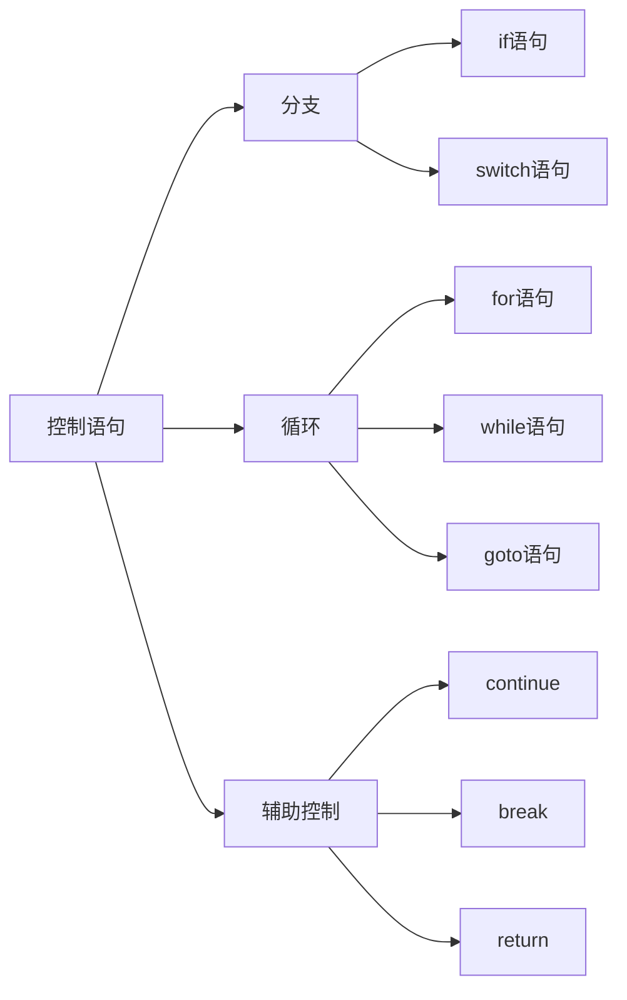
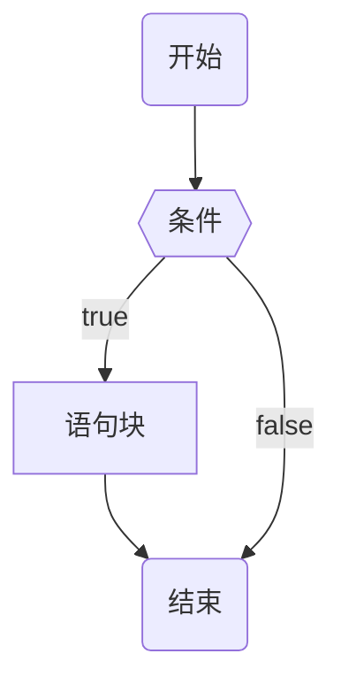
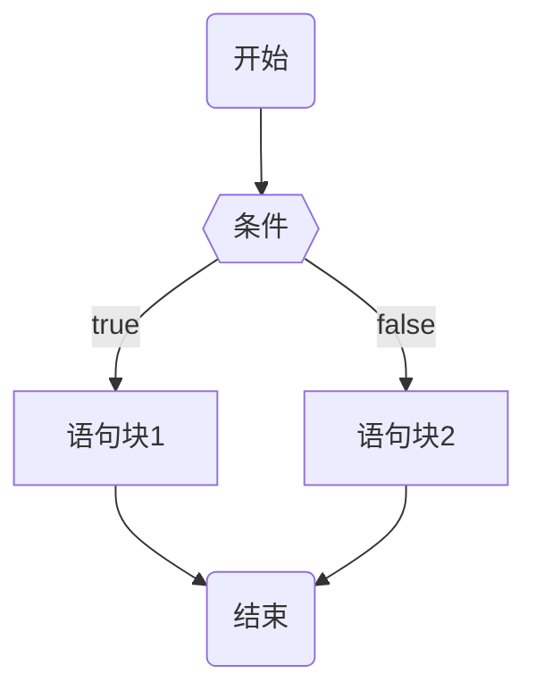
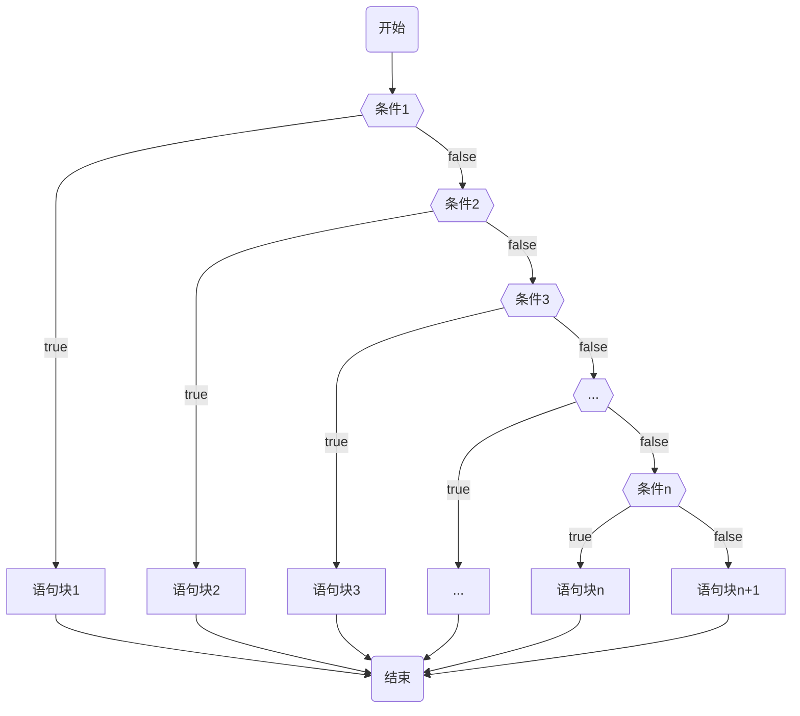
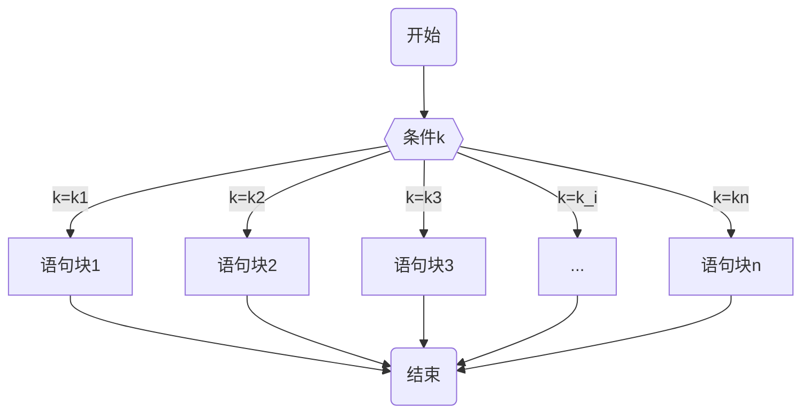

# 控制语句
控制语句分类:


## 一、分支语句
### 1.1 if语句

**流程图**:

**语法规则**:
```c
……
if(表达式)
{
    语句块1; // 表达式为真时, 执行语句块1
}
……
```
**说明**: 
* 表达式为真时, 执行语句块1
* 可以在if语句块里面继续嵌套if语句
* 语句块1如果只有**一条语句**时, 可以不用花括号({})括起来。
* 若是多条语句, 这必须使用花括号({})括起来, 表示同一层级语句。
* 表达式一般为**关系表达式**或**逻辑表达式**
* 表达式也可以是任意类型数据, 可以不是表达所
* 表达式的返回值是一个\_Bool类型数据

**示例代码**
```c
#include <stdio.h>

int main()
{
	int a = 1;
	int b = 2;
	if (a < b)
	{
		printf("%d\n", a);
	}
	return 0;
} 

```

### 1.2 if(condition){语句块1;}else{语句块2;}语句

**流程图**:


**语法规则**:
```c
……
if(条件)
{
    语句块1;  // 条件成立执行
}
else
{
    语句块2;  // 条件不成立执行
}
……
```

**说明**:
* 条件成立执行语句块1
* 条件不成立执行语句块2
* 每个分支中可以嵌套if语句


### 1.3 if(condition 1){语句块1}else if(condition 2){语句块2}…else if(condition n-1){语句块n-1}else{语句块n}语句

**流程图**:


**语法规则**:
```c
...
if(条件1)
{
    语句块1;
}
else if(条件2)
{
    语句块2;
}
else if(条件3)
{
    语句块3;
}
...
else if(条件n)
{
    语句块n;
}
else
{
    语句块n+1;
}
...
```

**说明**:
* 依次从上到下判断条件, 如果**条件i成立**则执行**语句块i**
* **条件i成立**后, 条件i后面的条件**不会在进行判断**。
* 如果条件都不成立, 则执行else语句块n
* 每条分支可以嵌套if语句


### 1.4 switch(int c){case c:{语句块1;break;} default:{语句块;}}语句

多分支选择结构. 当分判断条件过于多变复杂, 使用if语句会产生较多的判断条件,
使代码结构比较混乱. 

switch语句可以解决这类问题。
**流程图**:


**语法规则**:
```c
...
int ch;
switch(ch)
{
    case ch_1:  // 注意冒号结束。
    {
        语句块1;
        break;  // 每一个case必须要有break语句
    }
    case ch_2:
    {
        语句块2;
        break;
    }
    ...
    case ch_n:
    {
        语句块n;
        break;
    }
    default:
    {
        语句块n+1;
        [break;]  // default放在最后, 可以省略break, 否则不能省略。
    }

}
...
```

**说明**:
* 判断switch(int ch)中ch是否等于ch\_i; 如果等于执行case ch\_i下代码块i.
* 参数: ch参数是整型数据、字符型、枚举类型数据. ch\_i: 常量表达式, 即是语句标号
* break的作用是终止case ch\_i并跳出switch结构


## 二、循环
循环就是重复的做同一件事情. 

C语言中的循环结构:
* goto语句构成的循环
* while循环
* do…while循环
* for循环

### 2.1 goto语句
无条件强制跳转语句。
**语法**:
```c
标号:
    代码块;

goto 标号;
```
**说明**:
* 强制跳转到**标号**的代码块
* 使用goto语句, 可以构成循环结构。
  * 在标号的代码块中使用goto语句强制跳转到当前标号代码块
  * 使用goto语句构成循环时, 注意添加条件控制, 避免构成死循环。
  * 使用goto语句建立循环的特点
    * 易于理解
    * 减少嵌套
    * 帮助编译器做代码优化
* 可以将出口集中到一处. 当函数出口比较多时, 可以集中出口到一个位置. 使用goto语句实现

### 2.2 while循环
while循环是当前循环: 条件成立执行循环, 条件不成立退出循环.
即: 先判断条件; 如果条件成立, 执行循环体; 否则执行退出循环.

**语法规则**:
```c
...
while(表达式)
{
    循环体语句;
}
...

```
**说明**:
* 表达式: 
  * 通常是关系表达式和逻辑表达式
  * 也有可能是任意类型数据, 不是表达式
  * 表达式的返回值是一个\_Bool类型数据

**示例程序**:
```c
#include <stdio.h>
 
int main()
{
    int i = 0, sum = 0;
    while (++i < 101)                                                       
    {
        sum += i;
    }
    printf("1+2+...+100 = %d\n", sum);
 
    return 0;
}

```

### 2.3 do...while循环
do...while循环是直到型循环: 直到条件不满足时, 结束循环。
即: 先执行循环体, 在判断条件. 如果条件成立,继续执行循环体; 如果条件不成立, 退出循环. 

**语法规则**:
```c
...
do
{
    循环体;
}while(表达式);
...
```

**说明**:
* 表达式:
  * 通常是关系表达式和逻辑表达式
  * 也有可能是任意类型数据, 不是表达式
  * 表达式的返回值是一个\_Bool类型数据

**示例程序**
```c
#include <stdio.h> 
int main()
{
    int hundred, ten, unit;
    int st = 100;
    do
    {
        hundred = st / 100;
        ten = (st / 10) % 10;
        unit = st % 10;
        if(hundred * hundred * hundred + ten * ten * ten + unit * unit * uni
        {
            printf("%d 是水仙花数\n", st);
        }
    }while(st++ < 999);                                                     
    return 0;
}   

```

### 2.4 for循环
for循环也是当前循环: 条件成立才执行循环体; 条件不成立退出循环. 
即: 先判断条件; 如果条件成立, 执行循环体; 否则执行退出循环.

**语法规则**
```c
...
for(表达式1; 表达式2; 表达式3)
{
    循环体;  
}
...

```
**说明**:
* 1. 先执行表达式1, 表达式1为循环条件的初始值. 
  * 可以写在for语句之前, 即: for( ;表达式2;表达式3)
* 2. 在执行表达式2: 
  * 表达式2: 一般为关系表达式, 返回一个\_Bool类型的数据
  * 如果表达式2返回的值是真值, 执行循环体中的内容; 如果表达式2返回的值是假值, 退出循环. 
  * 表达式2也是可以省略的, 但是在循环体内必须要有跳出循环条件.
    * 即: for(表达式1; ;表达式3)
* 3. 循环体执行结束后, 执行表达式3:
  * 表达式3: 改变条件的初始值
  * 表达式3也是可以省略, 省略后在循环体中也要有改变条件初始值的语句
    * 即: for(表达式1; 表达式2; )
* 4. 执行完表达式3, 转到第2步, 向下继续执行. 


**示例程序**:
```c
#include <stdio.h>

int main()
{
    int sum1 = 0;
    for (int i = 0; i <= 100; i++)
    {
        sum1 += i;
    }
    printf("1+2+...+100 = %d\n", sum1);
 
    int sum2 = 0;
    int i = 0;
    for(;i<=100;)
    {
        sum2 += i;
        i++;
    }
    printf("1+2+...+100 = %d\n", sum2);

    int sum3 = 0;
    for(int i = 0;;i++)
    {
        if(i <= 100)
        {
            sum3 += i;
        }
        else
        {
            break;

        }
    }
    printf("1+2+...+100 = %d\n", sum3);
    return 0;
}

```

### 2.6 语句嵌套

分支语句、循环语句是可以相互嵌套的.

* 循环语句嵌套时; 执行一次外层循环, 内层循环就会完整的执行一次. 

**示例程序**
```c
#include <stdio.h>

int main()
{
    printf("九九乘法表\n");
    for(int i = 1; i<=9; i++)
    {
        for(int j = 1; j<=i; j++)
        {
            printf("%d * %d = %d", i, j, i * j);
        }
        printf("\n");
    }
    return 0;
}
```
## 三、辅助控制语句
### 3.1 break语句
在`switch条件语句`和`循环语句`中都可以使用break语句：
* 当它出现在`switch条件语句`中时, 作用是**终止某个case并跳出switch结构.**
* 当它出现在`循环语句`中. 作用是**跳出循环语句**,即: 结束循环, 执行后面的代码. 

### 3.2 continue语句
在循环语句中，如果希望立即终止**当前循环**，并执行下一次循环.

### 3.3 return语句
return语句主要用在两个位置:
1. 函数的返回值
2. 结束主程序

**语法规则**:
```c
...
return 表达式
```
**说明**
* 表达式: 是一个具体的值、各种表达式
  * 如果是表达式, 这先计算表达式的值, 在将这个值返回到调用函数的位置

* 在普通函数中的return语句是退出函数, 并返回函数的值
* 在主函数中的return语句是结束程序运行, 并返回程序结束的代码.


