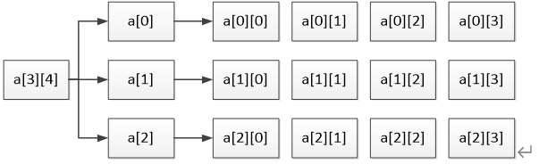

# 数组和字符串

* 构造类型之一
* 具有一定顺序关系的若干个变量的集合, 组成数组的各个变量称为数组元素
* 数组元素的**数据类型相同**, 用数组名和下标确定. 
* 数组可以是多维的, 也可以是多维的

## 一、数组
### 1.1 一维数组
* 只有一个下标的数组, 在计算机中是连续存储的
* C语言中, 一维数组的定义如下:
  * `[存储类型] 数据类型 数组名[常量表达式] [= {初始化值}]`
    * 数组名: 表示数组在内存中的首地址, 是地址常量. 
    * 常量表达式: 常量表达式的值确数组的长度
    * sizeof(数组名): 计算数组占用的内存空间. 
    * 数组在编译时, 分配的内存时连续的. 内存字节数 = 数组长度 * sizeof(数组数据类型)
    * 数组下标是从0开始的; 在使用数组时, 应当注意避免数组越界。C语言也不对数组作越界检查
* 一维数组的使用规则:
  * 数组必须先定义, 后使用
  * 只能逐个引用数组元素, 不能一次性的引用整个数组
  * 数组元素表示语法: 数组名[下标]
    * 下标可以是整型常量, 也可以是整型变量。
* 一位数组的初始化:
  * 在定义数组时, 为数组每一个元素赋初值, 为数组初始化
  * 初始化规则:
    * 对于auto数组(局部数组)不进行初始化, 系统为数组元素随机赋初值
    * 对于static数组的元素, 系统为数组元素自动赋值0
    * 可以只给部分元素赋初值; 没有赋值的元素, 系统自动赋值0. 
    * 对于不规定数组长度的数组, 定义时必须初始化. 给几个元素值, 数组长度就是几.


**示例程序**:
* 冒泡排序法
```c
#include <stdio.h>               
#include <stdbool.h>

int main()
{
    int array[] = {1, 3, 2, 6, 10, 9, 7, 12};
    long int n = sizeof(array)/sizeof(array[0]);
    bool exchange;
    exchange = true;
    printf("当前数组为: ");
    for(int k = 0; k < n; k++)
    {
        printf("%d ", array[k]);
    }
    printf("\n");
    int i = 0;
    while (exchange && i < n)
    {
        for(int j = 0; j < n - i - 1; j++)
        {
            if(array[j] > array[j+1])
            {
                exchange = true;
                int tmp;
                tmp = array[j];
                array[j] = array[j + 1];
                array[j + 1] = tmp;
                exchange = false;
            }

        if (!exchange)
        {
            exchange = true;
        }
        i++;
    }
    printf("交换后的数组: ");
    for(int k = 0; k < n; k++)
    {
        printf("%d ", array[k]);
    }
    printf("\n");

    return 0;
}
```
### 1.2 二维数组
* 具有两个维度的数组称为二维数组.
  * C语言中二维数组定义:
    * `[存储类型] 数据类型 数组名[常量表达式1][常量表达式2] [={初始化值}]`
    * 数组名: 表示数组在内存中的首地址, 是地址常量.
    * 常量表达式1: 代表二维数组的行数
    * 常量表达式2: 代表二维数组的列数
    * 定义或声明时, 列数是不能省略的, 行数可以省略
    * 每个维度的下标都是从0开始计算
    * 元素个数 = 行数 * 列数
    * 所占空间长度 = 元素个数 * sizeof(数组的数据类型)
  * 说明:
    * 数组名的命名规则同标识符一致. 
    * 在内存中并不存在二维数组, 二维数组实际的硬件存储器是连续编址的. <br>也就是说内存中只有一维数组, 即放完一行之后顺次放入第二行, 和一维数组存放方式是一样的. 
    * 内存中为一维数组, 按行优先存储.
    * 可以将二维数组看成一个一维数组, 每个元素是一个一维数组.  
  * 二维数组图像概念:
    * 
    * 上图定义了一个3行4列的二维数组a, 共3 * 4 = 12个数据,二维数组a是按行进行存放的，先存放a[0]行, 再存放a[1]行, 最后存放a[2]行, 并且每行有四个元素, 也是依次存放的. 
    * 二维数组a可以看成由三个元素组成, 分别是a[0] a[1] a[2], 每个元素右是存放四个元素的一位数组. a[0] a[1] a[2]表示一维数组的数组名, 即二维数组的行名.  
* 二维数组的使用规则:
  * 数组要先定义, 才能使用
  * 不能一次性引用数组, 只能逐个元素引用
  * 引用方法: 数组名[下标1]\[下标2]
    * 下标可以是具体整型常量, 也可以是整型变量.
* 二维数组初始化:
  * 分段赋值
  * 整体连续赋值
  * 部分赋值, 没有被赋值的元素默认设置为0
  * 当行数不指定时, 必须初始化


### 1.3 多维数组
二维及二维以上的数组均为多维数组. 三维以上的数组使用较少.
* C语言中多维数组的定义:
  * `存储类型 数据类型 数组名[常量表达式1][常量表达式2]...[常量表达式n] [ = {初始化数据}]`
* 相关说明和二维数组一致.


**多维数组使用示例**
* 打印杨辉三角形
```c
#include <stdio.h>

int main()
{
    int double_array[10][10];
    for (int i = 0; i < 10; i++)
    {
        for (int j = 0; j <= i; j++)
        {
            double_array[i][j] = 1;  //将要被打印的数据赋值为1
        }
    }

    for (int i = 1; i < 10; i++)
    {
        for(int j = 1; j < i; j++)
        {
            double_array[i][j] = double_array[i-1][j] + double_array[i-1][j-1];  // 计算杨辉三角形对应位置的值
        }
    }
    for (int i = 0; i < 10; i++)
    {
        for (int j = 0; j <= i; j++)
        {
            printf("%-8d ", double_array[i][j]);  // 打印杨辉三角形
        }
        printf("\n");
    }

    return 0;
}  
```

* 求二维数组a[3]\[4]中的最大值, 并求出最大值所在的位置
```c
#include <stdio.h>

int main()
{
    int array[3][4] = {{1, 4, 3, 5},{2, 8, 6, 10},{0, 7, 9, 11}};
    int max = array[0][0];
    int max_row;
    int max_col;
    for (int i = 0; i < 3; i++)
    {
        for (int j = 0; j < 4; j++)
        {
            if (array[i][j] > max)
            {
                max = array[i][j];
                max_row = i + 1;
                max_col = j + 1;                                                                                                                                                                            
            }
        }
    }
    printf("array's max is %d\nmax_row = %d\nmax_col = %d\n", max, max_row, max_col);
    return 0;
}

```

## 二、字符数组与字符串
区别:
1. C语言没有字符串这一个数据类型, 它是通过字符数组来模拟的字符串.
2. 字符串以字符'\0'作为结束标志
3. 字符串一定是字符数组, 字符数组不一定是字符串. 

### 2.1 字符数组

* 数组的元素是字符类型数据的数组, 称为字符数组
  * C语言中, 字符数组的定义:
    * `存储类型 char 数组名[常量表达式1][常量表达式2]...[常量表达式n] [ = {初始化的值}]`
    * 有几个常量表达式就是几维字符数组
    * 连续定义的两个字符数组在内存中可能是连续存放的
* 字符数组的使用
  * 先定义在使用
  * 不建议整个数组引用, 建议逐个逐个元素的使用.
  * 使用%s来输出字符数组时, 字符数组一定要以'\0'结尾. 否则会出现错误输出结果. 
    * %s输出字符数组时, 系统会逐个输出字符数组元素, 直到遇到'\0'停止输出. 
* 字符数组的初始化
  * 逐个元素的赋值
    * 编译器不判断数组是越界. 
    * 如果字符数组部分赋值, 没有被赋值的部分默认填充'\0'; '\0'的ASCII值等于0
    * 示例代码
    ```c
   // 逐个元素初始化
   char ch1[5] = {'H', 'e', 'l', 'l', 'o'};  // 
   char ch2[] = {'H', 'e', 'l', 'l', 'o'};   // 自动匹配字符数组大小
   char ch3[5] = {'B', 'o', 'y'};            // 没有被初始化的最后两个元素, 系统自动初始化'\0'
    ```
  * 通过字符串对数组元素进行赋值
    * 示例代码
    ```c
   // 字符串形式初始化
   char ch4[6] = {"Hello"};  
   char ch5[6] = "Hello";                    // 可以省略花括号
   char ch6[] = "Hello";                     // 自动匹配字符数组大小
    ```
* 二维字符数组的初始化
  
  * **示例程序**
```c
#include <stdio.h>
int main()
{
    char ch1[] = {'H', 'e', 'l', 'l', 'o'}; // 一维字符数组逐个元素初始化
    char ch2[7] = " Hello"; // 一维字符数组 字符串形式初始化
    printf("ch1 = %s\t *ch1[4] = %p\n",ch1, &ch1[4]);  // 输出结果: Hello Hello
    printf("ch2 = %s\t *ch2 = %p\n", ch2, ch2);
    if((&ch1[4] + 0x1) == ch2)
    {
        printf("true\n");
    }
    printf("二维字符数组\n");
    char ch3[][7] = {"Apple", "Orange", "Grape", "Pear", "Peach"}; // 二维数组的初始化
    int n = sizeof(ch3) / sizeof(ch3[0]);
    for (int i = 0; i < n; i++)
    {
        puts(ch3[i]);
    }

    printf("\n");

    int m = sizeof(ch3[1])/sizeof(ch3[1][0]);
    for (int i = 0; i < n; i++)
    {
        for (int j = 0; j < m; j++)
        {
            putchar(ch3[i][j]);
        }
        putchar('\n');
    }

    return 0;
}

```

### 2.2 字符串
字符串是字符数组以字符'\0'结束的字符数组. C语言中是没有字符串着一个数据类型.
* 字符串的定义, 即是定义一个字符数组
* 字符串的初始化同字符数组初始化一致; 但是必须注意, 要以字符'\0'结束才会是一个字符串,

**示例代码**:

* 输入一个字符串, 并将它反序输出.
```c
#include <stdio.h>
#include <string.h>

int main()
{
    //char ch[] = "Hello";
    char ch[20];
    printf("请输入一个字符串");
    gets(ch);
    for (int i = strlen(ch) - 1; i>=0; i--) // 仅返序输出, 字符串不变.
    {
        putchar(ch[i]);
    }
    putchar('\n');
    return 0;
}
```

```c
#include <stdio.h>
#include <string.h>

int main()
{
    char ch[10];
    printf("请输入字符串:");
    gets(ch);
    int length = strlen(ch);
    int i = 0, j = length - 1;
    while(i<j)  // 将字符串反转
    {
        char tmp;
        tmp = ch[i];
        ch[i] = ch[j];
        ch[j] = tmp;
        i++;
        j--;
    }
    printf("反序输出字服串:");
    puts(ch);
    return 0;
}
```


### 2.3 字符串函数
C标准库中提供了很多的字符串处理函数; 它们在头文件string.h中. 
我们要使用时必须提前引入: `#include <string.h>`


**常用的字符串处理函数**:

1. 求字符串的长度函数 `strlen`
2. 字符串复制函数 `strcpy` `strncpy`
3. 字符串拼接函数 `strcat`  `strncat`
4. 字符串比较函数 `strcmp` `strncmp`

#### 2.3.1 获取字符串长度函数 `strlen`
* 函数原型 `size_t  strlen(const  char  *s)`
  * 功能: 传入一个字符串的头指针, 计算字符串占的字节数, 第一次遇到'\0', 停止计算, 返回所得到的值. 即: 排除'\0'
  * 参数: 字符串的头指针. 字符串的首地址.
  * 返回值: `size_t`类型数据, 无符号整数. 以字节形式返回字符串长度.
  * 一个中文字符占3个字节. 一个英文字符占1个字节.
  * strlen()函数与sizeof()运算符区别在于,strlen()函数排除'\0', 而sizeof()运算符不会排除'\0'

**示例程序**
```c
#include <stdio.h>
#include <string.h>

int main()
{
    char ch1[] = {'A',0, 'a', '\0','h'};
    printf("%ld\n",strlen(ch1)); // 输出1
    char ch2[] = "\n\t\x09\089";
    printf("%ld\n", strlen(ch2));  // 输出3
    char ch3[] = "Hello world";
    printf("%ld\n", strlen(ch3));  // 输出11
    char ch4[] = "你好， 世界";
    printf("%ld\n",strlen(ch4));   // 输出16 一个中文字符占3个字节
    return 0;
}
```

```c
#include <stdio.h>
#include <string.h>

int main()
{
    size_t length(char *s);
    printf("%ld\n", length("hello world!"));
    return 0;
}


size_t length(char *s)
{
    size_t len = 0;
    while(s[len] != '\0')
    {
        len++;
    }
    return len;
}

```

#### 2.3.2 字符串复制函数 `strcpy` `strncpy`
* 函数原型: `char *strcpy(char *dest, const char *src)`<br> &emsp;&emsp;&emsp;&emsp;`char *strncpy(char *dest, const char *src, size_t n)`
  * 功能:
    * `strcpy()`函数复制`src`指向的字符串到`dest`指向的字符数组中. 包括字符'\0'; `dest`指向字符数组要由足够的空间存放`src`指向的字符串. 
    * `strncpy()`函数与`strcpy()`函数类似. 只是最多复制n个直接`src`值向的字符串到`dest`指向的字符数组. 警告: 如果前n字节`src`指向的字符串中没有'\0', 那么复制到`dest`指向的字符数组中就不会以'\0'结束. 即: `dest`仅仅是字符数组. 
  * 参数:
    * 对于`strcpy()`函数和`strncpy()`函数前两个参数是一致的
    * `dest`: 字符数组的头指针, 字符数组的首地址.
    * `src`: 将要被复制字符串的头指针, 字符串的首地址.
    * `n`: `strncpy()`函数需要的参数, 复制`src`指向字符串`n`个字节数.
    * 如果`n`小于`src`指向字符串的长度, `strncpy()`会自动添加'\0'.
  * 返回值:
    * `strcpy()`函数和`strncpy()`函数均返回一个执行新字符数组的指针.

    

**示例程序**
```c
#include <stdio.h>
#include <string.h>

int main()
{
    char s[] = "Hello world!";
    char dest1[100], dest2[100];
    strcpy(dest1, s);  // 复制字符串s到dest1字符数中
    strncpy(dest2, s, 5);  // 复制字符串s的前五个字符到dest2字符数组中.
    dest2[5] = '\0';  // 给dest2添加一个结束标构成字服串
    puts(dest1);  // 输出dest1字符数组
    puts(dest2);  // 输出dest2字符数组
    return 0;
}
```

```c
#include <stdio.h>
#include <string.h>

int main()
{
    char s[] = "Hello world!";
    char dest1[100], dest2[100];
    char *copy(char *dest, const char *src);
    copy(dest1, s);
    puts(dest1);
    return 0;
}


char *copy(char *dest,const char *src)
{
    if(sizeof(dest) >= sizeof(src))
    {
        long int length = strlen(src);
        for(int i = 0; i < length; i++)
        {
           dest[i] = src[i];
        }
    }
    else
    {
        printf("dest空间不足\n");
    }
    return dest;
}

```

#### 2.3.3 字符串连接函数 `strcat` `strncat`
* 函数原型: `char *strcat(char *dest, const char *src)`<br> &emsp;&emsp;&emsp;&emsp; `char *strncat(char *dest, const char *src, size_t n)`
  * 功能: 将`src`指向的字符串添加到`dest`指向的字符串(在dest字符串结束标志'\0'开始连接); 字符'\0'也会被添加, `dest`必须要由足够空去存放`src`, 否则程序行为是不可预测的;缓冲区溢出.
  `strncat()`函数与`strcat()`函数使用方式一致, strncat()函数, 
  * 参数:
    * strcat函数和strncat函数前两个参数一致
    * `dest`: 目标**字符串**的首地址
    * `src`: 源**字符串**的地址
    * `n`: strncat函数使用参数, 表示字符串`src`要连接到`dest`字符串的字节数.
  * 返回值:
    * 成功: 返回dest字符串的首地址
    * 失败: 返回NULL

**示例程序**:
```c
#include <stdio.h>
#include <string.h>

int main()
{
    char dest[20] = "Hello ";
    char src[] = "world!";
    puts(dest);  // 输出Hello 
    strcat(dest, src);  // 拼接
    puts(dest);
    strncat(dest, src, 3);
    puts(dest);
    return 0;
}

```


#### 2.3.4 字符串比较函数 `strcmp`  `strncmp` `strcasecmp` `strncasecmp`
* 函数原型: `int strcmp(const char *s1, const char *s2)`<br> &emsp;&emsp;&emsp;&emsp; `int strncmp(const char *s1, const char *s2, size_t n)`
  * 功能: 函数`strcmp()`和函数`strcasecmp()`都是比较字符串`s1`和`s2`大小,逐个字符比较, 最终比较的是字符串编码. 函数`strncmp()`和函数`strncasecmp()`都是比较的是前n个字符的大小.
  * 参数:
    * 函数`strcmp() strcasecmp()`和函数`strncmp() strncasecmp()`前两个参数一致.
    * `s1`: 字符窜的头指针, 字符串的首地址
    * `s2`: 字符串的头指针, 字符串的首地址
    * `n`: 函数`strncmp()`需要的参数, 表示要比较两个字符串的前几个字符
    * 对于函数strcasecmp()和函数strncasecmp()均是忽略字符的大小写.
  * 返回值:
    * `s1 = s2`: 返回值 等于 0
    * `s1 < s2`: 返回值 小于 0
    * `s1 > s2`: 返回值 大于 0

**示例程序**:
```c
#include <stdio.h>
#include <string.h>

int main()
{
    char s1[] = "你好世界";
    char s2[] = "世界你好";

    if (strcmp(s1, s2)>0)
    {
        printf("s1 > s2\n");
    }
    else if (strcmp(s1, s2) < 0)
    {
        printf("s1 < s2\n");
    }
    else
    {
        printf("s1 == s2\n");
    }
    
    char s3[] = "Hello world";
    char s4[] = "hello world";
    if (strcmp(s3, s4)>0)
    {
        printf("s3 > s4\n");
    }
    else if (strcmp(s3, s4) < 0)
    {
        printf("s3 < s4\n");
    }
    else
    {
        printf("s3 == s4\n");
    }
    return 0;
}
```

#### 2.3.5 字符串转数值函数 `atoi` `atof` `atol` `atoll`
* 函数在头文件`stdlib.h`中, 函数原型如下:
  * 数值形字符串转化为基本整型: `int atoi(const char *nptr)`
  * 数值形字符串转化为长整型: `long atol(const char *nptr)`
  * 数值形字符串转化为长长整型:`long loong atoll(const char *nptr)`
  * 数值形字符串转化为双精度浮点型: `double atof(const char *nptr)`
* 参数:
  * `nptr`: 数值形字符串

**示例程序**:
```c
#include <stdio.h>
#include <stdlib.h>

int main()
{
    char s2i[] = "12";
    printf("%d\n", atoi(s2i));
    char s2l[] = "13";
    printf("%ld\n", atol(s2l));
    char s2ll[] = "14";
    printf("%lld\n", atoll(s2ll));
    char s2f[] = "3.1415";
    printf("%f\n", atof(s2f));
    
    return 0;
}

```

#### 2.3.6 字符串查询函数 `strchr` `strrchr` `strstr` `strcasestr`
* 函数原型:
  * 在字符串中查询字符(返回第一次匹配到字符的地址): `char *strchr(const char *s, int c)`
  * 在字符串中查询字符(返回最后一次匹配到字符的地址): `char *strrchr(const char *s, int c)`
  * 在字符串中查询字符串: `char *strstr(const char *haystack, const char *needle)`
  * 在字符串中查询字符串(忽略大小写): `char *strcasestr(const char *haystack, const char *needle)`                                       
* 参数
  * 函数`strchr()`和函数`strrchr()`参数:
    * `s`: 被查询字符串的首地址
    * `c`: 要查询的字符
  * 函数`strstr()`和函数`strcasestr()`参数:
    * `haystack`: 被查询字符串的首地址
    * `needle`: 要查询的字符串的首地址
* 返回值:
  * 函数`strchr()`和函数`strrchr()`
    * 成功: 返回查询到的字符在字符串中的地址
    * 失败: 返回NULL
  * 函数`strstr()`和函数`strcasestr()`
    * 成功: 返回查询到字符串的首地址
    * 失败: 返回NULL

**示例程序**:
```c
#include <stdio.h>
#include <string.h>

int main()
{
    char s[] = "hello world!";
    printf("%p\t%p\n",&s[4], strchr(s, 'o'));
    printf("%p\t%p\n", &s[9], strrchr(s, 'l'));
    printf("%p\t%p\n", &s[0], strstr(s, "hello"));
    char s2[] = "Hello world!";
    printf("%p\t%p\n", &s2[0], strcasestr(s2, "hello"));

    return 0;
}
```

#### 2.3.7 字符检查函数
字符检查函数在头文件`ctype.h`中
这些函数的返回值是一个`_Bool`类型的数据
* 检查字符是否为字母字符: `int isalpha(int c)`
* 检查字符是否为数值: `int isdigit(int c)`
* 检查字符是否为大写字符: `int isupper(int c)`
* 检查字符是否为小写字符: `int islower(int c)`

#### 2.3.8 字符大小写转化函数
字符大小写转化函数在头文件`ctype.h`中
函数的返回值为转化后的值
* 小写转化为大写: `int touuper(int c)`
* 大写转化为小写: `int tolower(int c)`


**示例程序**:
```c
#include <stdio.h>
#include <ctype.h>

int main()
{
    int ch;
    printf("请输入字符:");
    while ((ch = getchar()) != EOF)
    {
        getchar();
        if (isalpha(ch))
        {
            printf("\n输入字符是字母\n");

            if(isupper(ch))
            {
                printf("upper: %c\n", ch);
                printf("转为小写: %c\n", tolower(ch));
            }
            else
            {
                printf("lower: %c\n", ch);
                printf("转为大写: %c\n", toupper(ch));
            }
        }
        else
        {
            printf("输入的不是字母:\n");
            printf("输入字符是: %c\n", ch);
        }
        printf("\n请输入字符: ");
    }
    return 0;
}
```


