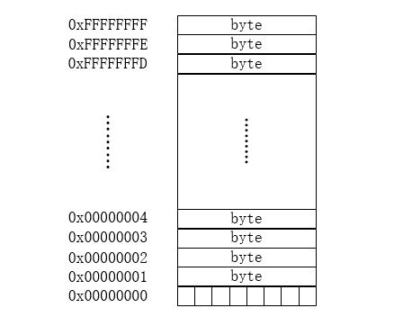
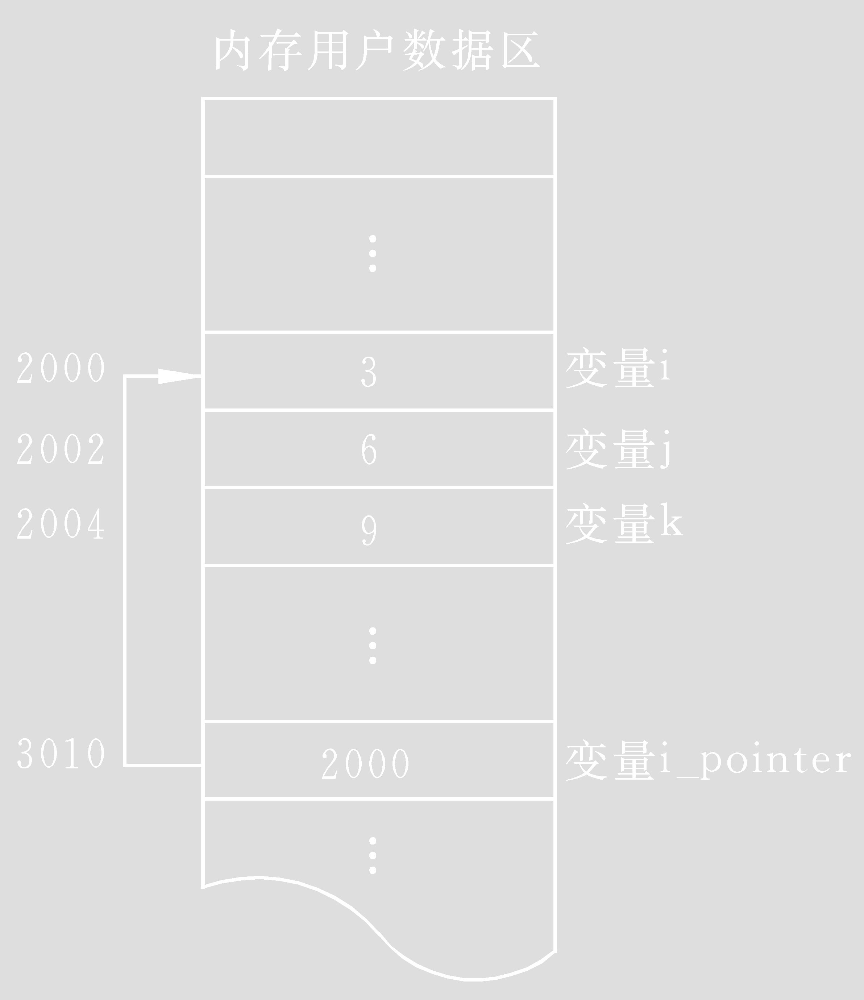
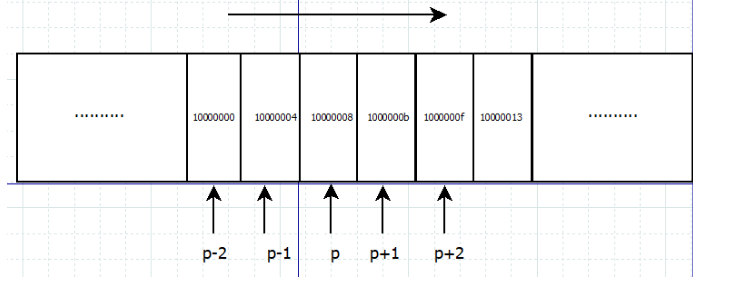
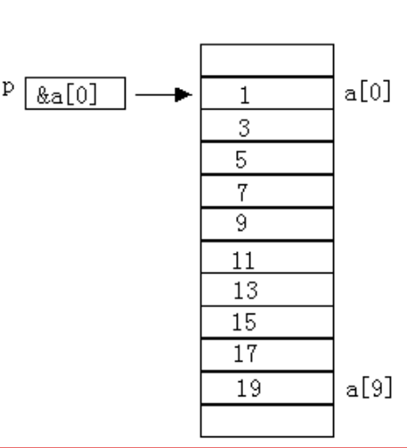
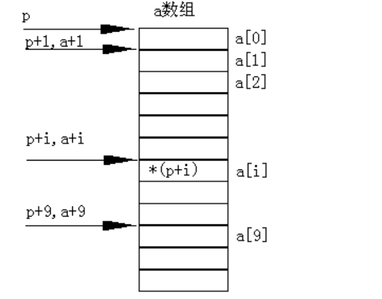
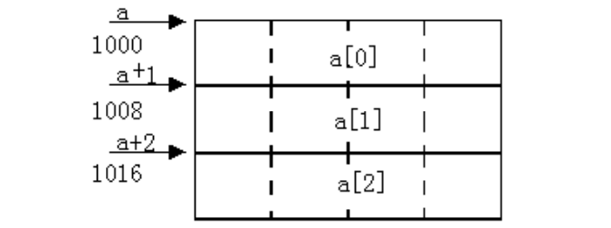
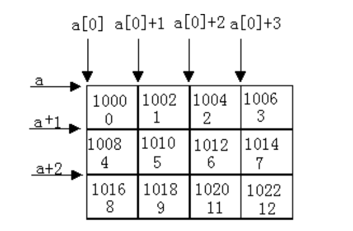
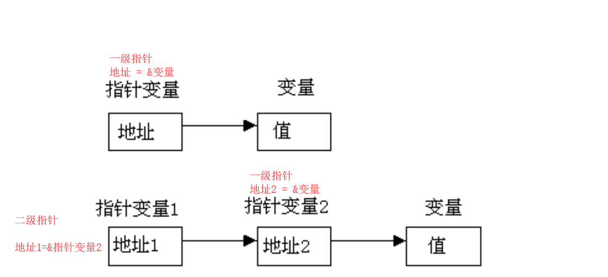
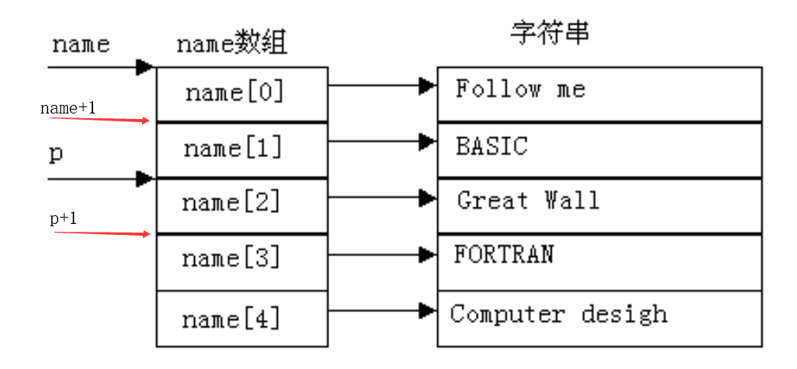

[toc]

# 指针

## 一、相关基础
存储器：计算机的组成中，用来存储程序和数据，辅助CPU进行运算处理的重要部分
存储器分为: 内存、外存
* 内存即内部存储器, 用于暂时存放程序或数据, 特性: 断电数据丢失
* 外存即外部存储器, 用于长期存放程序或数据, 特性: 能够长时间保留数据,断电数据仍然存在.

**内存是用于沟通外存和cpu的桥梁**
* 暂存放CPU中的运算数据
* 暂存与硬盘等外部存储器交换的数据

与内存相关的概念: 物理存储器和存储地址空间

* 物理存储器: 实际存在的具体存储器芯片
  * 主板上装插的内存条
  * 显示卡上的显示RAM芯片
  * 各种适配卡上的RAM芯片和ROM芯片
* 存储地址空间: 对存储器编码的范围
  * 编码: 对每个物理存储单元(一个字节)分配一个号码
  * 寻址: 根据分配的号码找到相应的存储单元，完成数据的读写

## 二、内存地址

在内存中, 每一个字节单元, 都会更具处理器的位数分配一个相应位数的编号(32为或64位), 这个编号称为**地址**, 即为内存地址.



内存中的每一个数据都会分配相应的地址: 
* char: 占一个字节分配一个地址.
* int: 占四个字节分配四个地址.
* float struct 函数 数组等都会占相应的内存大小.
* 变量是对程序中数据存储空间的抽象.


## 三、指针和指针变量
在C语言中, **内存单元的地址称为指针**, **用于存放内存地址的变量称为指针变量**.
> CPU通过内存寻址对存储在内存中的某个指定数据对象的地址进行定位.
> 这里, 数据对象是指存储在内存中的一个指定数据类型的数值或字符串, 
> 它们都有一个自己的地址; 而指针便是保存这个地址的. 
> 也就是说: **指针是一种保存地址的数据类型**. 
> 指针变量: 用于保存地址的变量.

### 3.1 指针变量的定义和使用
**语法规则**:
`<存储类型> <数据类型> * <指针变量的变量名> [= <地址>]`
* 指针定义时的存储类型就是指针变量的存储类型.
* 指针定义时的数据类型; 不是指针变量的数据类型, 而是指针指向数据(目标)的数据类型
* 指针变量的数据类型就是指针类型.
* 指针变量的赋值: `指针变量名 =地址常量或指针变量` `&变量名: 取变量的地址`. `&`可以取得一个变量在内存中的地址。但是, 不能取寄存器变量; 因为寄存器变量不在内存里, 而在CPU里面, 所以是没有地址的.
  * 赋值时, 应当将普通变量的地址赋值给一个具有相同数据类型的指针.
  * 也可以把已有地址值的指针变量赋值给具有相同类型的指针变量. 
* 获取指针指向的数据(指针目标): `* 指针变量`.
  * `*`操作符操作的是指针变量指向的内存空间, 即: 访问指针变量指向的内存区域.
  * 指针目标: 指针指向的的区域是程序的一个变量的内存空间, 则这个变量称为指针的目标变量. 简称指针的目标. 

**示例程序**:
```c
#include <stdio.h>

int main()
{
    int *p1;  // 定义一个指针变量, p1这个变量存放的数据就是地址
    int a = 10;
    p1 = &a;  // 将变量a的地址赋值给p1指针变量. 指针变量p1的初始化.
    printf("%p\t%d\n", p1, *p1); // *p1表示取出p1指针指向的值
    printf("%p\n", &p1);  // &p1获取指针变量p1的内存地址 
    return 0;
}
```

**示例图**:


* 指针变量是用于保存地址的变量. 
* 指针变量也在内存中占空间. 


### 3.2 指针运算
* 指针运算是以指针变量**存放的地址**作为运算量而进行的运算.
* 实质是地址的计算
* 只能进行**赋值运算、算术运算和关系运算**
  * 算术运算:
    * 以指针的目标数据类型为单位进行计算.
    * 改变的是指针变量保存的地址, 不改变指针变量在内存中的地址.
  * 比较运算:
    * 对指针变量保存的地址进行比较, 指向地址大的指针>指向地址小的指针.
    * 指针变量与一般整数变量之间的关系运算没有意义.但是, 可以和0进行等于(==)或不等于(!=)的关系运算, 判断指针是否为空指针.


**常用算术算符**:
|运算符|计算形式|含义|
|:---:|:---:|:---:|
|+|p+n|指针p向地址大的方向移动n个数据|
|-|p-n|指针p向地址小的方向移动n个数据|
|++|p++|指针p向地址大的方向移动1个数据|
|--|p--|指针p向地址小的方向移动1个数据|
|-|p1-p2|计算指针p1与指针p2之间有几个数据|

**说明**: 
* 不同类型的指针相加减无意义.
* 对指针变量p进行+/-/++/--运算所得结果也是一个指针, 只是指针所指向的内存地址相比于p所指的内存地址前进或者后退了i个操作数.
  * 设指针p是一个int类型的指针，指向内存地址0x10000008处。则p++将指向与p相邻的下一个内存地址，由于int型数据占4个字节, 因此p++所指的内存地址为1000000b. 其余类推. 不过要注意的是, **这种运算并不会改变指针变量p自身的地址, 只是改变了它所指向的地址**
  
  * `p +/- n`移动的地址量是`n * sizeof(p目标的数据类型)`
  * `p++ p--`移动的地址量是`sizeof(p目标的数据类型)`
* 指针 - 指针: 表示两个指针之间有几个操作数.
  * 只有当两个指针都**指向同一个数组中的元素**时, 才允许从一个指针减去另一个指针. 两个指针相减的结果的类型是`ptrdiff_t`, 它是一种有符号整数类型. 减法运算的值是两个指针在内存中的距离(以数组元素数据类型的长度为单位, 而不是以字节为单位), 因为减法运算的结果将除以数组元素类型的长度. 

**示例程序**:
```c
#include <stdio.h>

int main()
{
    int *p1, a;
    p1 = &a;
    long *p2, b;
    p2 = &b;
    int c[10];
    int *p3, *p4;
    p3 = &c[1];
    p4 = &c[5];
    printf("p1的地址: %p\tp1+2的地址: %p\n", p1, p1+2);
    printf("p2的地址: %p\tp2+2的地址: %p\n", p2, p2+2) ;
    printf("p4 - p3: %ld\n", p4 - p3);
    return 0;
}
```

### 3.3 指针大小
使用sizeof()测量指针的大小，得到的总是：4或8
* sizeof()测的是保存指针变量占用内存空间的大小
* 在32位平台，所有的指针（地址）都是32位(4字节)
* 在64位平台，所有的指针（地址）都是64位(8字节)


**示例程序**
```c
#include <stdio.h>

int main()
{
    int *p1;
    long *p2;
    char *p3;
    float *p4;
    printf("sizeof(p1): %ld\tsizeof(p2): %ld\nsizeof(p3): %ld\tsizeof(p4): %ld \n", sizeof(p1), sizeof(p2), sizeof(p3), sizeof(p4));

    return 0;
}
```

## 四、指针与数据

### 4.1 指针访问基本数据类型
`存储类型 基本数据类型 * 指针变量名 [= 地址]`

**示例程序**:

```c
#include <stdio.h>

int main()
{
    int a, *p1 = &a;   // 基本整型指针变量, 指针目标的数据类型是int型
    float b, *p2 = &b;  // 浮点型指针变量, 指针目标的数据类型是float型
    char c, *p3 = &c;  // 字符型指针变量, 指针目标的数据类型是char型
    printf("请输入数据: ");
    scanf("%d %f %c", p1, p2, p3);
    printf("展示输入的数据: %d %f %c\n", *p1, *p2, *p3);

    return 0;
}
```

### 4.2 通过指针间接修改变量的值

```c
#include <stdio.h>

int main()
{
    int a = 10;
    int *p = &a;
    *p = 100;  // 将p指向的内存空间的值修改为100;
    printf("%d\n", a);

    return 0;
}
```
**程序说明**:
* `*`: 指针运算符(或称“间接访问” 运算符)
  * `*p = 100` 等价于 `a = 100`
* 对指针变量进行赋值操作时不能在指针变量前加`*`: `*p = &a`是错误表达式
* 不允许将一个数赋值给指针变量.

### 4.3 野指针和空指针
* 野指针: 
  * 指针变量也是变量, 是变量就可以任意赋值, 不要越界即可(32位为4字节, 64位为8字节), 但是, **任意数值赋值给指针变量没有意义, 因为这样的指针就成了野指针**, 此指针指向的区域是未知(操作系统不允许操作此指针指向的内存区域). 所以, **野指针不会直接引发错误, 操作野指针指向的内存区域才会出问题**. 
    * 没有初始化的指针变量是指向任意地址的, 可能指向的内存空间是不能被使用. **指针变量要初始化之后才能被使用**.
* 空指针:
  * 野指针和有效指针变量保存的都是数值, 为了标志此**指针变量没有指向任何变量(空闲可用)**, C语言中，可以把`NULL`赋值给此指针, 这样就标志此指针为空指针, 没有任何指向任何变量.
  * 空指针: 指针变量没有指向任何的变量, 即: 这个指针是空闲可用的. 没有指向任何变量.
  * `NULL`: NULL是一个值为`0`的宏常量, 即: `#define NULL (void *)0`

### <span name="void">4.4 万能指针 `void *`</span>
`void *`指针: 可以指向任意变量的内存空间

**使用方式**:
```c
#include <stdio.h>

int main()
{
    void *p = NULL;  // 定义一个voide *指针
    int a = 10;
    p = (void *)&a;  // 将变量a的地址赋值给p. 赋值是, 要将a的地址强制转换为void * 类型
    *(int *)p = 100;  // 要对p指向的内存空间进行操作时, 要将指针p转化它的目标数据类型为相应的类型.
    printf("%d\n", a);
    return 0;
}

```
**相关说明**:
* 使用`voide *` 指针时, 要先将其初始化为NULL.
* 当使用`voide *` 指针指向某个数据类型变量的空间时, 先将这个变量的地址转化为`void *`类型
* 当要操作`voide *`指针指向的内存空间时, 要将次指针转化为内存空间对应的数据类型


### 4.5 const限定的指针变量
* `const 数据类型 * 指针变量名`: 常量指针: 指向常量的指针. 指针指向的区域中的值不能改变.
  * 修饰`*指针变量名`, 限制通过指针修改目标值, 但是指针变量存储的地址可以修改.
  * 指针指向内存区域不能修改, 即: `*指针变量名 = 数值` 会出错.
  * 指针指向可以变, 即: `p = &变量名` 不会出错.
* `数据类型 * const 指针变量名`: 指针常量: 指针指向的区域不能改变.
  * 修饰`指针变量名`, 指针变量存储的地址不能修改. 指向的目标可以修改.
  * 指针指向不能变, 即: `指针变量名 = &变量名` 会出错.
  * 指针指向的内存可以修改, 即: `*指针变量名 = 数据` 不会出错.

**示例程序**
```c
#include <stdio.h>

int main()
{
    int a = 10;
    int b = 20;
    const int * p1 = &a; // 修饰*，指针指向内存区域不能修改，指针指向可以变
    p1 = &b; // 成功执行
    //  *p1 = b; // 执行不会成功, 不能修改指针指向的值. 
    printf("a = %d *p1 = %d\n",a, *p1);
    
    int * const p2 = &b; // 修饰p1，指针指向不能变，指针指向的内存可以修改
    // p2 = &a; // 执行出错.
	*p2 = 222; // 执行成功
    printf("%d\n", b);
    return 0;
}
```

## 五、指针与数组
在C语言中,
* 数组的指针: 指数组在内存中的起始地址.
  * 一维数组的数组名是一维数组的指针(起始地址).
* 数组元素的地址: 数组元素在内存中的起始地址.

### 5.1 指针与一维数组
* 一个数组是由连续的一块内存单元组成的
* 数组名就是这块连续内存单元的首地址
* 一个数组也是由各个数组元素(下标变量)组成的
* 每个数组元素按其类型不同占有几个连续的内存单元
* 一个数组元素的首地址也是指它所占有的几个内存单元的首地址。

#### 5.1.1 指向一维数组元素的指针
**语法格式**:
`
数据类型 数组名[常量表达式];
数据类型 * 指针变量名;
指针变量名 = 数组名;
`
**说明**
* C语言规定, 数组名代表数组的首地址, 也就是第`0`号元素的地址
  * `指针变量名 = 数组名` 等价于 `指针变量名 = &数组名[0]`


#### 5.1.2 通过指针引用一维数组元素
C语言规定: 如果指针变量`p`已指向数组中的一个元素, 则`p+1`指向同一数组中的下一个元素.
引入指针变量后, 就可以用两种方法来访问数组元素了:
* 如果指针变量`p`的初值为`&a[0]`
  * `p+i`和`a+i`就是`a[i]`的地址, 或者说它们指向`a数组`的`第i个`元素。
  * `*(p+i)`或`*(a+i)`就是`p+i`或`a+i`所指向的数组元素, 即`a[i]`. 例如, `*(p+5)或*(a+5)`就是`a[5]`. 
  * 指向数组的指针变量也可以带下标，如`p[i]`与`*(p+i)等价`
* 引用一个数组元素可以用: 
  * **下标法**, 即用`a[i]`形式访问数组元素. 
  * **指针法**, 即采用`*(a+i)或*(p+i)`形式, 用间接访问的方法来访问数组元素, 其中`a`是数组名, `p`是指向数组的指针变量, 其初值为: `p=a`. 




**示例程序**:
```c
#include <stdio.h>

int main()
{
    int a[10], i;
    for(i = 0; i < 10; i++)
    {
        *(a+i) = i;  // a[i] = i a[i], *(a+i): 都是访问的的数据的第i+1个元素.
    }
    printf("输出数组: ");

    int *p;
    p = a;
    for(i = 0; i < 10; i++)
    {
        printf("%d ", *p++);  // p[i]
    }
    printf("\n");
    return 0;
}
```
**程序说明**:
* `*(a+i)` 等价于` a[i]`
* `p++` 等价于 `p = P+1`, `*p++`表示取出`p`指向区域的值, 在使指针指向一个数组元素
* 如果`p = a`则`p[i] == a[i] == *(p+i) == *(a+i)`
  * 指针变量是地址变量.
  * 而数组的指针(也叫数组名)是地址常量.


**通过指针反转一维数组元素**:
```c
#include <stdio.h>

int main()
{
    int a[] = {1, 2, 3, 4, 5, 6, 7, 8, 9};
    int n = sizeof(a)/sizeof(a[0]);
    int *head_p = a, *tail_p = &a[n-1];
    printf("原数组: ");
    for (int i = 0; i < n; i++)
    {
        printf("%d ", *head_p++);
    }
    putchar('\n');
    head_p = a;
    while (head_p < tail_p)
    {
        int tmp;
        tmp = *head_p;
        *head_p = *tail_p;
        *tail_p = tmp;
        head_p++;
        tail_p--;
    }
    printf("交换后的数组: ");
    head_p = a;
    tail_p = &a[n - 1];
    while(head_p != tail_p)
    {
        printf("%d ", *head_p);
        head_p++;
    }
    printf("%d\n", *tail_p);
    return 0;
}

```

### 5.2 指针与二维数组
多维数组: 具有两个和两个以上下标的数组.
在C语言中, 二维数组的元素在内存中按行优先连续存储.

**使用一级指针遍历二维数组**
```c
#include <stdio.h>

int main()
{
    int a[3][5] = {{1, 2, 3, 4, 5}, {6, 7, 8, 9, 10}, {11, 12, 13, 14, 15}};
    int *p = &a[0][0];  // *p=a: 会报警告.
    for (int i = 0; i < 15; i++)
    {
        printf("%d ",*p++);
    }
    puts("");
    return 0;
}
```
**说明**:
* 通过一级指针, 遍历二维数组, 可以发现, 二维数组确实是按行优先顺序存放在内存中.
* `int *p = a`会报警告.建议使用 `int *p = &a[0][0]`


* 可以把二维数组看作一个由多个一维数组组成的.
  * 比如`int a[3][3]`, 含有三个元素: `a[0]   a[1]   a[2]`
  * 元素`a[0]   a[1]   a[2]`都是一个一维数组名.
  
* 二维数组名代表数组的起始地址; 数组名+1: 表示移动一行元素. 因此, 二维数组名常被称为行地址
  * 数组名: 代表二维数组首行地址
  * 数组名+i: 代表第i行地址
  * `*(数组名+i)`: 获取二维数组第i行的首地址, 即: `二维数组名[i]`: 也表示二维数组第i行的首地址.
  * `数组名+i，数组名[i]，*(数组名+i)，&数组名[i][0]`: 表示二维数组第i行的首地址.
  

* 二维数组元素的地址
  * 对于二维数组第i行的元素的获取. `二维数组名[i][j]`: 获取二维数组第i行第j列的数据
  * `二维数组名[i]`表示的的时第i行的首地址. `二维数组名[i]+j`表示的是二维数组第i行第j列数据的地址.
  * `(数组名+i)+j  数组名[i]+j  *(数组名+i)+j  &数组名[i][j]`: 均表示的是二维数组第i行第j列元素的地址.
  * `*((数组名+i)+j)  *(数组名[i]+j)  *(*(数组名+i)+j) *(&数组名[i][j])`: 均表示二维数组第i行第j类的元素.
  

#### 5.2.1 指向二维数组的指针变量
行指针: 存储行地址的指针变量称为行指针.

**行指针的定义**:
`
存储类型 数据类型 二维数组名[常量表达式1][常量表达式2]
存储类型 数据类型 (* 指针变量名)[常量表达式2]
指针变量名 = 二维数组名
`
* 常量表达式2: 表示的是指针+1要移动的数据个数.它表示一个指针变量, 指向包含`[常量表达式]`个元素的一维数组.
* 常量表达式2: 表示一个长度, 这长度表示一个二维数组分解为多个一维数组时, 一维数组的长度, 也就是二维数组的列数.
* `(*指针变量名)`: 两边的括号不可少, 如缺少括号则表示是指针数组, 意义就完全不同了
* 行指针初始化之后, 意义同二维数组名一致. 

#### 5.2.2 指向二维数组的指针变量的引用

```c
#include <stdio.h>

int main()
{
    int a[3][5] = {{1, 2, 3, 4, 5}, {6, 7, 8, 9, 10}, {11, 12, 13, 14, 15}};
    int (*p)[5];
    p = a;
    for (int i = 0; i < 3; i++)
    {
        for(int j = 0; j < 5; j++)
        {
            printf("%5d",*(*(p+i)+j));
        }
    }
    puts("");
    return 0;
}
```
**程序说明名**:
* 二维数组通过行指针获取元素的地址:
  * `*(行指针变量名 + i) + j ==> *(p+i)+j`: 行指针指向的二维数组的第i行第j列元素的地址.
  * `*(二维数组名 + i) + j ==> *(a+i)+j`: 二维数组的第i行第j列元素的地址
  * `行指针变量名[i]+j ==> p[i]+j`: 行指针指向的二维数组的第i行第j列元素的地址.
  * `二维数组名[i]+j ==> a[i]+j`: 二维数组的第i行第j列元素的地址
* 二为数组通过行指针获取元素:
  * `*(二维数组元素地址) ==> *(*(p+i)+j) == *(*(a+i)+j) == *(p[i]+j) == *(a[i]+j)` : 获取二维数组第i行第j列的元素.

### 5.3 字符指针与字符串

#### 5.3.1 字符指针
* 通常, 把char类型的指针称为字符指针. 字符指针与字符数组有密切联系, 它常被用来处理字符数组和字符串.

与之前学习的数值数组指针的操作完全一致.

```c
#include <stdio.h>

int main()
{
    char ch[] = {'H', 'e', 'l', 'l', 'o'};
    char *p_ch = ch;
    printf("%c\n",*(p_ch+1));
    for (int i = 0; i < sizeof(ch) / sizeof(ch[0]); i++)
    {
        printf("%-3c", *p_ch++);
    }
    printf("\n");

    return 0;
}
```

#### 5.3.2 字符串指针
* 用字符指针处理字符串时.对字符指针的初始化:
  * 将字符串的首地址赋值给字符指针.
  * 并非将字符串赋值给该指针.
* 在C语言中, 当一个字符指针指向一个字符串常量时, 不能修改值针指向区域的值.
  * 例如:
  `
  char *p = "Hello world!";
  *p = 'h'; //错误. 字符串常量不能修改.
  `
  * 两个字符指针指向同一个字符串常量, 两个指针指向的内存地址时一致的, 两个指针变量的地址不同. 
  

**示例程序**:
```c
#include <stdio.h>

int main()
{
    char str[] = "hello world!";
    char *p = str;
    printf("%p %p\n", p, str);
    printf("%c\n", *p);
    
    char *p1 = "hello world";
    char *p2 = "hello world";  // p1 p2指向的内存地址一样.
    printf("&p1 = %p %p %s\n", &p1, p1, p1);
    printf("&p2 = %p %p %s\n", &p2, p2, p2);
    return 0;
}
```

#### 5.3.3 字符指针应用
* 实现字符串连接
```c
#include <stdio.h>

int main()
{
    char str1[40] = "hello";
    char str2[] = " world!";
    
    char *p1 = str1;
    char *p2 = str2;
    while (*p1 != '\0')
    {
        p1++;
    }
    while (*p2 != '\0')
    {
        *p1 = *p2;
        p1++;
        p2++;
    }
    *p1 = *p2;
    printf("%s\n", str1);

    return 0;
}
```

## 六、指针数组
* 一个数组的元素值为指针则是指针数组
* 指针数组是一组有序的指针的集合
* 指针数组的所有元素都必须是具有**相同存储类型**和**指向相同数据类型**的指针变量
### 6.1 指针数组的定义和引用
**语法规则**:
`
存储类型 数据类型 *指针数组名[常量表达式]
`
* 指针数组名: 表示该指针数组的其实地址.
* 通常可用一个指针数组来指向一个二维数组. 指针数组中的每个元素被赋予二维数组每一行的首地址, 因此也可理解为指向一个一维数组. 

**示例程序**:
```c
#include <stdio.h>

int main()
{
    int a[3][3] = {{1 ,3, 5}, {2, 4, 6},{7, 8, 9}};
    int *p[3] = {a[0], a[1], a[2]};  // 指针数组, 里面由p[0] p[1] p[2]三个元素, 每个元素都是整型指针
    // 通过指针数组遍历二维数组, 并求出所用元素的和.
    int i = 0;
    while (i < 3)
    {
        int j = 0;
        while (j < 3)
        {
            sum += *(p[i] + j);  // *(*(p+i) + j) == *(p[i] + j)
            printf("%5d", *(p[i] + j));
            j++;
        }
        printf("\n");
        i++;
    }
    printf("数组元素的和: %d\n", sum);
    return 0;
}
```
**说明**:
* 指针数组p中存放的时指针. 这些指针的存储类型相同, 指针目标的数据类型相同.
* 指针数组p中的元素p[i], 是存放的二维数组的第i行, p[i] + j获取二维数组第i行第j列元素的地址.
* `*(p[i] + j)` 获取二维数组第i行第j列的元素.


## 七、指向指针的指针: 多级指针

* 把指向指针变量的指针变量, 称为多级指针.
* 对于指向处理数据的指针称为一级指针变量, 简称一级指针
* 把指向一级指针变量的指针变量称为二级指针变量, 简称二级指针.


* 二级指针以上的使用较少.

### 7.1 二级指针的定义和引用
**二级指针定义语法**:
`存储类型 数据类型 ** 指针变量名 [= 二级地址]`


**说明**:
* 数据类型是值最终指针指向区域的数据类型.
* 指针变量名: 存放数据的内存地址
* \*指针变量名: 存放指针变量的地址
* \*\*指针变量名: 取到最终的数据

**示例程序**:
```c
#include <stdio.h>

int main()
{
    int m =10;
    int *p = &m;
    int* *q = &p;

    printf("p=%p *q=%p\n", p, *q);
    printf("%d %d %d\n", m, *p, **q);

    return 0;
}
```
**程序说明**:
* `p`: 指向变量`m`指针, 存放的是变量m的地址.
* `q`: 指向指针变量`p`的指针, 存放的是指针变量p的地址.
* `*q`: 等于`p`, 指向变量`m`的指针. 变量`m`的地址
* `**q`: 等于`m 和 *p`, 获得变量`m`的值


### 7.2 多级指针的运算

* 指针变量+1, 是向地址大的方向移动一个目标数据. 类型, 多级指针变量运算也是以目标指针变量为单位进行偏移
* 比如, `int **p`,`p+1`移动一个`int *`变量所占的内存空间.
* 又比如, `int ***p`, `p+1`移动一个`int **`变量所占的内存空间


### 7.3 多级指针和为指针数组


name 是一个指针数组，它的每一个元素是一个指针型数据，其值为地址。name 是一个数组，它的每一个元素都有相应的地址。数组名 name 代表该指针数组的首地址。name+1 是 mane[i]的地址。name+1 就是指向指针型数据的指针（地址）。还可以设置一个指针变量 p，使它指向指针数组元素。P 就是指向指针型数据的指针变量。

**程序示例**:
```c
#include <stdio.h>
#include <string.h>

int main()
{
    char str[][20] = {"Follow me","BASIC","Great Wall","FORTRAN","Computer desighn"};
    char *name[] = {str[0], str[1], str[2], str[3], str[4]};
    char **p = name;
    
    printf("name = %p p = %p\n", name, p);
    printf("name+1 = %p, p+1 = %p\n", name+1, p+1);
    // 按字符一个一个打印
    for(int i = 0; i < 5; i++)
    {
        for(int j = 0; j < strlen(*(p+i)); j++)
        {
            printf("%c", *(*(p+i)+j));  // *(p[i] + j)  *(*(name+i)+j)
        }
        printf("\n");
    }
    printf("\n");
    // 按字符串打印
    for(int i = 0; i < 5; i++)
    {
        printf("%s\n", *p);
        p++; 
    }
    printf("\n");
    return 0;
}
```
## 八、再谈`void *`
<a href="#void">万能指针</a>

* 使用`void *`指针遍历一维数组
```c
#include <stdio.h>

int main()
{
    int a[] = {1, 3, 5, 7, 9};
    void *p = NULL;
    p = (void *)a;
    for(int i = 0; i < sizeof(a)/sizeof(a[0]); i++)
    {
        printf("%-5d", *((int *)p + i));
    }
    printf("\n");
    return 0;
}
```
