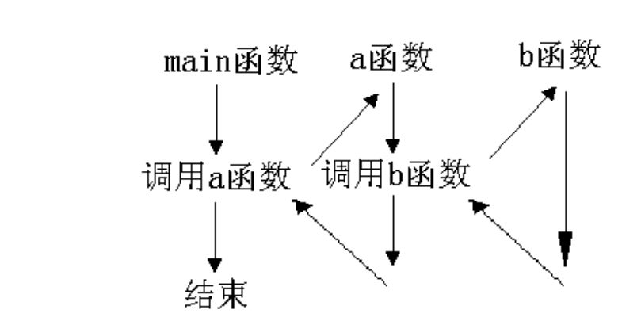
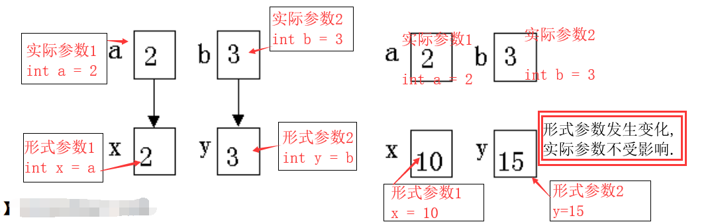
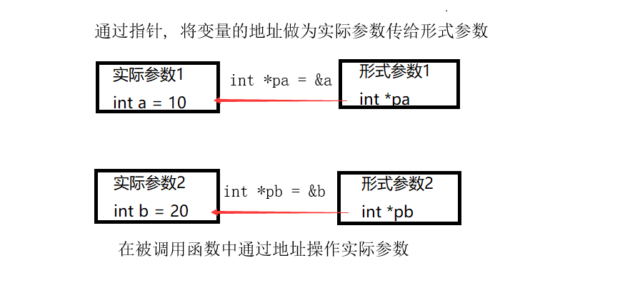
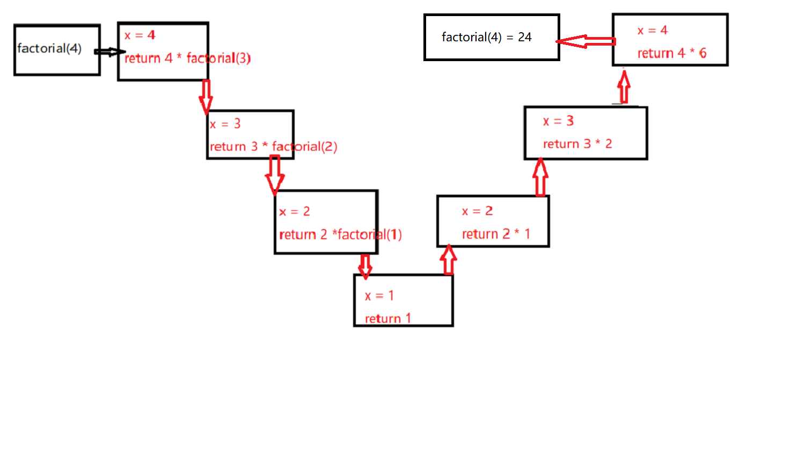

[toc]

# 函数

函数是一个完成特定功能的代码块, 其程序代码独立, 通常可以带返回值, 也可以不带返回值

## 一、函数定义的一般形式
### 1.1 无参数函数的定义
`
数据类型 函数名()
{
    函数要执行的语句;
    return 表达式;
}
`
### 1.2 有参数函数的定义
`
数据类型 函数名(形式参数1, 形式参数2, ..., 形式参数n)
{
    函数要执行的语句;
    return 表达式;
}
`
### 1.3 相关说明
* `数据类型`: 函数的数据类型, 也即是整个函数返回值的类型. 
  * `return 表达式;`: 表达式的值要与函数的数据类型保持一致.
  * 如果无返回值, 数据类型为`void`型.
* `函数名`: 函数名一般用于表示函数的功能, 命名时要做到见名知义.
  * 函数命名遵循标识符命名规则.
* 形式参数之间用逗号(,)隔开.
  * 形式参数的定义: `数据类型 形式参数名`
* 花括号内的内容`{函数要执行的语句}`: 称为函数体, `函数要执行的语句`是大于等于零个语句.


## 二、函数的声明

* 函数的声明就是指函数的原型.
* 函数声明时, 形式参数名可以省略, 但是数据类型不能省略.
  * 有参数函数的声明: `数据类型 函数名(形式参数1, 形式参数2, ... , 形式参数n);`
  * 无参数函数的声明: `数据类型 函数名();`

## 三、函数调用

### 3.1 函数调用一般形式
* 有参数函数调用: `函数名(实际参数1, 实际参数2, ... , 实际参数n);`
  * 实际参数: 调用函数传递给被调用函数的数据. 一个确切的数据
* 无参数函数调用: `函数名();`


### 3.2 函数调用的方式
1. `变量名 = 函数名(实际参数表);`: 调用函数, 将函数的返回值存放在变量名中.
2. `函数名(实际参数);`: 没有返回值函数调用
3. `函数1(函数2());`: 将函数作为实际参数调用. 将函数2调用后的返回值作为参数传递到函数1中.
4. 函数可以嵌套调用.
    

## 四、再论函数声明
* 被调用函数定义在调用之前, 声明和定义一起完成.
* 被调用函数定义在调用之后, 必须先声明. 如果不声明, 则无法被调用.
* 函数调用时, 要先声明.
* 库函数调用时, 可以不用声明.
  * 必须引入头文件, 头文件中包含了被调用函数的声明.

## 五、函数参数传递
函数之间参数传递有以下方式:
1. 全局变量
2. 复制传递方式
3. 地址传递方式

### 5.1 全局变量
* 在函数体外部定义的变量就是全局变量. 在它们之后定义的函数可以任意使用.
* 全局变量一经定义就会在它之后的任意位置可见并且可以使用. 函数的调用位置不同, 程序执行的结果可能会受到影响. 因此, 不建议使用
* 如果要在定义全局变量之前位置使用此全局变量, 可以在要使用的地方声明
  * 声明语法: `extern 数据类型 变量名`. 变量名要与定义的变量名一致.

**示例程序**:
```c
#include <stdio.h>

int a = 10;
void test1()
{
    extern int b; // 声明全局变量. b在test1之后定义, 在test1中无法使用, 可以使用extern声明全局变量.
    printf("in test1 a = %d\n", a);
    printf("in test1 b = %d\n", b);
}

int b = 20;
void test2();

int main()
{
    test1();
    printf("\n");
    test2();
    return 0;
}

void test2()
{
    printf("int test2 a = %d\n",a);
    printf("int test2 b = %d\n", b);
}
```
### 5.2 复制传递
* 调用函数将实际参数传递给被调用函数时, 被调用函数将同时创建同类型的形式参数, 并用实际参数初始化.
* 形式参数存放在新开辟的内存空间中; 因此, 在函数中改变形式参数的值, 实际参数的值不会被改变.




**说明**:
* 有几个实际参数要传递就要有几个形式参数用于接收传过来的实际参数.
* 函数定义时, 设计了几个形式参数, 在调用函数时就要传递几个实际参数.
* **实际参数与形式参数的数个数要匹配**

**示例代码**:
```c
#include <stdio.h>
int test1(int x, int y);

int main()
{
    int a = 2, b = 3;
    int c;
    printf("a: %p\tb: %p\n", &a, &b);
    c = test1(a, b);  // 调用test1函数时, 重新开辟内存空间用于存放a, b的值.
    printf("%d\n", c);
    return 0;
}

int test1(int x, int y)
{
    printf("x: %p\ty: %p\n", &x, &y);
    return x + y;
}
```

### 5.3 地址传递(指针传递)
* 实际参数是变量的地址,形式参数为同类型的指针.
* 在被调用函数中通过指针操作实际参数.



**示例代码**

```c
#include <stdio.h>

void exchange(int *pa, int *pb);

int main()
{
    int a = 10, b = 20;
    printf("before: a = %d, b =%d\n", a, b);
    exchange(&a, &b);
    printf("after: a = %d, b = %d\n", a, b);
    return 0;
}


void exchange(int *pa, int *pb)
{
    int tmp;
    tmp = *pa;
    *pa = *pb;
    *pb = tmp;
}
```

**说明**
* 在被调用函数`exchange`中通过指针操作实际参数
* 形式参数应当是一个与变量同类型的指针变量.

**示例程序**:
统计字符串中的小写字母, 并将小写字母转化为大写字母.

```c
#include <stdio.h>
#include <ctype.h>

int count_exchange(char *src, int n);

int main()
{
    char str[] = "hello world";
    int num;
    printf("%ld\n", sizeof(str)/sizeof(char));
    printf("字符串: %s",str);
    num = count_exchange(str, sizeof(str)/sizeof(char));
    printf("中小写字母有: %d个\n", num);
    printf("小写字母变成大写字母后的字符串: %s\n", str);

    return 0;
}

int count_exchange(char *src, int n) // char *src = str;
{
    int num = 0;
    while(*src)  // *src != '\0'
    {
        if(isalpha(*src))
        {
            if (islower(*src))
            {
                num++;
                *src -= ' ';  // *src = toupper(*src);
            }
        }
        src++;
    }
    return num;
}
```

## 六、数组在函数参数中的传递

* 全局数组变量, 将参数传递给函数.

* 复制传递方式, 将数组传递给函数
  * 实际参数为数组指针(数组名), 形式参数为数组名(本质是在一个指针变量)

* 地址传递方式
  * 实际参数是数组的指针, 形式参数为同类型数组的指针变量.

### 6.1 一维数组在函数参数中的传递
**示例程序**:
1. 编写函数, 计算一维整型数组的所用元素和. 以复制传递方式传递参数.
```c
#include <stdio.h>
int sum_array(int array[], int n);

int main()
{
    int a[] = {1, 3, 5, 3, 9, 10};
    int sum;
    sum = sum_array(a, sizeof(a)/sizeof(a[0]));
    printf("数组a求和: %d\n", sum);
    return 0;
}

int sum_array(int array[], int n)  // int array[]; 本质是 int *array=a;
{
    int sum = 0;
    for(int i = 0; i < n; i++)
    {
        sum += array[i];
    }
    return sum;
}
```
**程序说明**:
* 以复制传递方式传递数组参数, 传递到函数本质中的是数组的首地址. 型形式参数是指针变量. 
* 要将数组的元素个数传递到函数中去. 


2. 编写函数, 删除字符串中的空格. 要修改实际参数, 以地址传递方式, 将实际参数的地址传递给函数.
```c
#include <stdio.h>

void del_space(char *s);

int main()
{
    char str[] = "hel lo wor ld!  ";
    char *p = str;
    printf("删除空格前: %s\n", str);
    del_space(str);
    printf("删除空格后: %s\n", str);
    return 0;
}

void del_space(char *s)
{
    while(*s)
    {
        if((int)*s == 32)
        {
            char *t;
            t = s;
            while(*t)
            {
                *t = *(t+1);
                t++;
            }        
        }
        s++;
    }
    *s = '\0';
}
```

### 6.2 二维数组参数在函数中的传递.
1. 编写一个函数, 求整型二维数组的元素的和. 以复制方式传参.
```c
#include <stdio.h>

int sum_a(int a[][5],  int n);

int main()
{
    int a[][5] = {{1, 2, 3, 4, 5}, {6, 7, 8, 9, 10}, {11, 12, 13, 14, 15}};
    int sum = 0;
    sum = sum_a(a, sizeof(a)/sizeof(a[0]));
    printf("二维数组元素求和: %d\n", sum);
    return 0;
}

int sum_a(int a[][5], int n)  // int (*a)[5] = a;
{
    int sum = 0;
    for(int i = 0; i < n; i++)
    {
        for(int j = 0; j < 5; j++)
        {
            sum += a[i][j];  // a[i][j] 等价 *(*(a + i) + j) *(a[i] + j)
        }
    }
    return sum;
}
```
**程序说明**:
* 二维数组作为参数在函数中传递时, 形式参数要么指定第二维度大小, 要么指定所有维度大小
  * 函数设计为: `数据类型 函数名(数据类型 形参数组名[n1][n2])`或`数据类型 函数名(数据类型 形参数组名[][n2])`
* 如果不指定第一维度大小, 要将第一维度大小传递到函数中.
2. 编写一个程序, 二维字符数组中的字符串的大小写互换. 地址传递方式.

```c
#include <stdio.h>
#include <ctype.h>

void exchange_alpha(char (*s)[10], int n);

int main()
{
    char str[][10] = {"Apple", "Pear", "hello"};
    int n = sizeof(str)/sizeof(str[0]);
    exchange_alpha(str, n);
    for(int i = 0; i < n; i++)
    {
        printf("%s\n", str[i]);
    }
    return 0;
}


void exchange_alpha(char (*s)[10], int n)
{
    int i = 0;
    while(i < n)
    {
        for(int j = 0; j < 10; j++)
        {
           if(isalpha(*(*(s+i)+j)))
           {
               if(isupper(*(*(s+i)+j)))
               {
                   *(*(s+i)+j) = tolower(*(*(s+i)+j));
               }
               else
               {
                   *(*(s+i)+j) = toupper(*(*(s+i)+j));
               }
           }
        }
        i++;
    }
}
```

**程序说明**:
* 要对实际参数进行改变, 所以要将实际参数地址传递到函数中.
* 使用指向二维数组的指针变量作为形式参数用于接受二维数组.


## 七、指针函数

==函数返回值==是一个地址量的函数称为指针函数.
定义指针函数的一般形式:
`
存储类型 数据类型 * 函数名(参数)
{
    函数体语句;
}
`
**说明**:
1. 指针函数, 返回值是局部变量时, 应当注意是否能在离开函数时, 变量还能够存在
2. 通常是以下三种才能够被返回地址:==全局变量, 静态变量, 字符串常量, 参数本身==
3. 函数要进行组合调用时, 使用指针函数.

**修改下列程序**:
```c
#include <stdio.h>
#include <string.h>

char *getstring()
{
    char str[20];
    strcpy(str, "hello");
    return str;
}

int main()
{
    printf("%s\n", getstring());
    return 0;
}
```
**错误说明**:
* 局部变量不能进行返回. 离开局部变量作用的范围, 内存将会被销毁.
**修改说明**:
* 延长局部变量作用生存时间, 即可解决局部变量离开作用范围内存被销毁问题.
  * 使用全局变量
  * 使用static静态变量
  * 字符串常量

**示例程序**:
1. 编写一个指针函数, 删除字符串中的空格.
```c
#include <stdio.h>

char * del_space(char *s);

int main()
{
    char str[] = "hello world";
    char *p;
    p = del_space(str);
    printf("%s\n", p);
    return 0;
}

char * del_space(char *s)
{
    char *ret = s;
    char *p = s;
    while (*s)
    {
        if(*s != ' ')
        {
            *p++ = *s++;
        }
        else
        {
            s++;
        }
    }
    *p = *s;
    return ret;
}
```
2. 编写一个函数, 实现两个字符串的连接

```c
#include <stdio.h>

char * string_cat(char *dest, const char *src);

int main()
{
    char dest[100] = "welcome ";
    char src[] = "hello world";
    printf("未连接之前: %s\n", dest);
    char * ret = string_cat(dest, src);
    printf("连接之后: 数组名: %s \t 返回地址: %s\n", dest, ret);
    return 0;
}

char *string_cat(char *dest, const char *src)
{
    char *ret = dest;
    while(*dest)
    {
        dest++;
    }
    while(*src)
    {
        *dest++ = *src++;
    }
    *dest = *src;
    return ret;
}
```

## 八、递归函数和函数指针

### 8.1 递归函数
* 递归函数是指一个函数的函数体直接或间接调用了该函数自身.
* 递归函数调用执行过程分为两个阶段:
  * 递推阶段: 从原问题出发, 按递归公式递推. 从未知到已知, 最终达到递归终止条件.
  * 回归阶段: 按递归终止条件求出结果, 逆向逐步带入递归公式, 回归到原问题求解.

**示例程序**:
1. 求n!

```c
#include <stdio.h>
long long factorial(long n);
int main()
{
    long num = 0;
    long long a;
    printf("输入要计算的数据: ");
    scanf("%ld", &num);
    a = factorial(num);
    printf("%ld! = %lld\n", num, a);
    return 0;
}

long long factorial(long n)
{
    long long ret;
    if(n <= 1)
    {
        ret = 1;
    }
    else
    {
        ret = n * factorial(n -1);
    }
    return ret;
}
```
2. 求斐波拉切数列

```c
#include <stdio.h>

int fibolach(int);

int main()
{
    int n = 0;
    int i = 0;
    printf("输入要求几项斐波拉切数列: ");
    scanf("%d", &n);
    while(i < n)
    {
        printf("第%d项: %d\n",i + 1, fibolach(i));
        i++;
    }
    return 0;
}

int fibolach(int x)
{
    if (x == 0 || x ==1)
    {
        return 1;
    }
    else
    {
        return fibolach(x - 1) + fibolach( x - 2 );
    }
}
```

## 八、函数指针
* 函数指针变量: 指向函数的指针, 用于存放函数地址的变量. 
  * 函数地址: 函数的入口地址
  * 函数名: 代表函数的入口地址
* 函数指针变量的一般定义形式:
  `数据类型 (*函数指针变量名)(参数列表)`
  * 数据类型: 函数指针指向函数的数据类型保持一致
  * 参数列表: 函数指针指向函数的形式参数保持一致
  * (\*函数指针名): \*表示的是指针. 不可缺少

* 作用:
  * 减少代码修改. 
  * 增加函数的功能.

**示例代码**:
```c
#include <stdio.h>

int add(int m, int n);
int sub(int m, int n);
int mul(int m, int n);
int div(int m, int n);

int main()
{
    int a = 20, b = 10;
    int (*p)(int m, int n);
    p = add;
    printf("%d + %d = %d\n",a, b, (*p)(a, b));
    p = sub;
    printf("%d - %d = %d\n", a, b, (*p)(a, b));
    p = mul;
    printf("%d * %d = %d\n", a, b, (*p)(a, b));
    p = div;
    printf("%d / %d = %d\n", a, b, (*p)(a, b));
    return 0;
}


int add(int m, int n)
{
    return m + n;
}

int sub(int m, int n)
{
    return m - n;
}

int mul(int m, int n)
{
    return m * n;
}

int div(int m, int n)
{
    return m / n;
}
```
**调用qsort函数进行数组排序**
```c
#include <stdio.h>
#include <stdlib.h>

int compare(const void *, const void *);

int main()
{
    int a[] = {89, 34, 67, 90, 21, 10,44, 56,80};
    int n = sizeof(a)/sizeof(a[0]);
    int (*p)(const void *, const void *);
    p = compare;
    qsort(a, n, sizeof(int), p);


    for(int i = 0; i < n; i++)
    {
        printf("%-5d", a[i]);
    }
    printf("\n");
    return 0;
}


int compare(const void * p, const void *q)
{
    return (*(int *)p - *(int *)q);
}
```


## 九、函数指针数组
* 用于保存若干个函数名的数组
* 语法规则: `数据类型 (*函数指针名[大小])()`
  * 大小: 指存放函数的个数
  * 其他同普用函数指针.

**示例程序**:
```
#include <stdio.h>

int add(int m, int n);
int sub(int m, int n);
int mul(int m, int n);
int div(int m, int n);

int main()
{
    int a = 20, b = 10;
    //int (*p)(int m, int n);
    int (*p[4])(int m, int n);
    p[0] = add;
    printf("%d + %d = %d\n",a, b, (*p[0])(a, b));
    p[1] = sub;
    printf("%d - %d = %d\n", a, b, (*p[1])(a, b));
    p[2] = mul;
    printf("%d * %d = %d\n", a, b, (*p[2])(a, b));
    p[3] = div;
    printf("%d / %d = %d\n", a, b, (*p[3])(a, b));
    return 0;
}


int add(int m, int n)
{
    return m + n;
}

int sub(int m, int n)
{
    return m - n;
}

int mul(int m, int n)
{
    return m * n;
}

int div(int m, int n)
{
    return m / n;
}
```


