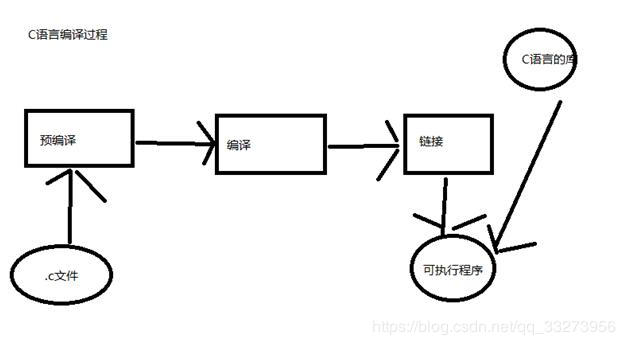

# `gcc_gdb`

## 一、GNU工具
* 编译工具: 编译源程序为可执行程序
* 调试工具: 对执行程序进行源码或汇编调试
* 软件工程工具: 用于协助多人开发或大型软件项目的管理
* 其他工具: 用于把多个目标文件链接成可执行文件的链接器, 或者用作格式转换的工具

## 二、`GCC`

### 2.1 简介

* 全称: GUN C Compile， GNU项目中符合ANSI C标准的编译器
* 可以编译C/C++/O-C/Java/Fortran/Pascal/Modula-3和Ada等多种编程语言
* `GCC `是可以在各种硬件平台编译出可执行程序的超级编译器, 其执行效率与一般编译器相比平均效率要高$20\%--30\%$
* 一个交叉编译器，适合嵌入式领域开发编译.

### 2.2 `gcc`支持的后缀名

|    后缀名     |        解释         |
| :-----------: | :-----------------: |
|     `.c`      |       c源程序       |
| `.C/.cc/.cxx` |      c++源程序      |
|     `.m`      |      O-C源程序      |
|     `.i`      |  预处理后的C源程序  |
|     `.ii`     | 预处理后的C++源程序 |
|    `.s/.S`    |   汇编语言源程序    |
|     `.h`      |       头文件        |
|     `.o`      |      目标文件       |
|   `.a/.so`    |   编译后的库文件    |

### 2.3 组件

* `分析器`: 将源程序转化为汇编语言代码. 分析器要知道目标机器的汇编语言
* `汇编器`: 将汇编语言代码转化为CPU可以执行的字节码
* `链接器`: 将汇编器生成的单独目标文件组合成可执行程序. 要知道目标格式
* `标准C库`: 核心C函数都有一个主要的C库来提供. 如果在应用程序中使用到了C库中的函数, 这个库就会通过链接器和源代码来生成最终的可执行程序.

### 2.4 `gcc`的使用 `gcc [options] [filenames]`

|      选项      |                             解释                             |
| :------------: | :----------------------------------------------------------: |
|      `-c`      |       只编译, 不链接成可执行文件.生成文件以`.o`为后缀.       |
| `-o out_name`  |            指定编译后的可执行文件名.默认为`a.out`            |
|      `-g`      |                           源码调试                           |
|   `-O或-O2`    |                        对程序进行优化                        |
| `-I  dir_name` |  将`dir_name`目录加入到程序头文件目录列表, 预编译过程使用.   |
| `-L dir_name`  | 将`dir_name`目录加入到程序函数档案库文件的目录列表, 链接过程中使用 |

### 2.5 `GCC`错误

* C语法错误
  * 修改源代码中错误的部分
* 头文件错误
  * 可能是头文件名错误
  * 可能是头文件所在目录名错误
  * 可能错误的使用了`" "`或`<>`

* 档案库错误
  * 可能是与目标文件相连的函数库有错误
    * 函数库名错误
    * 指定函数库所在目录名错误

### 2.6 `gcc`编译过程

分四个步骤:

1. 预处理

   头文件展开, 宏定义简单替换. 

   使用选项`-E`, 生成一个以`.i`为后缀的文件. 

2. 编译

   生成汇编代码

   使用选项`-S`， 生成一个以`.s`为后缀的文件

3. 汇编

   生成CPU能够识别的字节码

   使用选项`-c`, 生成一个以`.o`结尾的文件 

4. 链接

   链接源程序需要的库, 生成可执行文件.

## 二、`GBD`

`gdb`对源程序进行调试. 使用流程

* 使用`gcc`编译源程序时, **加上`-g`选项**
* `gdb 生成可执行文件名`: 进入调试界面
  * `l`: 查看源码文件
  * `b  行号`: 设置断点在`行号`位置
  * `info b`: 查看断点情况
  * `del num`: 删除第`num`个断点
  * `r`: 运行代码
  * `p   变量名`: 查看变量值
  * `n`: 单步运行, 跳过函数调用; `s`: 进入函数
  * `c`: 恢复程序运行到下一个断点.
  * `set args  值`: 传入命令行参数
  * `help [command]`: 帮助

