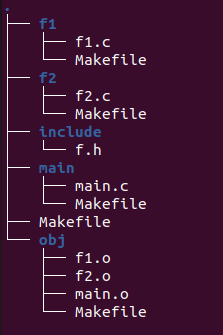

# Make

* 工程管理器, 管理较多文件
* `make`工程管理器, 是一个`自动编译管理器`. 根据文件时间戳自动发现更新过的文件, 减少编译工作量. 通过读入`makefile`文件来执行大量编译工作
* **==Make只编译发生改动后的代码文件, 而不是完全编译==**


# `makefile`基本结构

* `makefile`是`make`读入的唯一配置文件

  * 由`make`工具创建的目标体(`target`), 通常是目标文件或可执行文件
  * 要创建的目标体所依赖的文件(`dependency_file`)
  * 创建每个目标体需要运行的命令(`command`)
  * ==注意==: 命令行前必须是一个`TAB`, 否则编译错误为: *** missing separator. Stop.

* 格式:

  ```makefile
  target: dependency_file
  <tab> command
  
  .PHONY:clean
  clean:
  <tab> rm 中间文件名 
  ```

* 示例

  ```makefile
  hello.o : hello.c hello.h
  	gcc -c hello.c -o hello.o
  ```

* `makefile`创建变量和使用变量

  ```makefile
  递归展开:    变量名=目标名1 目标名2 ... 目标名n
  简单赋值:    变量名:=目标名1 目标名2 ... 目标名n
  使用变量:    $(变量名)
  ```

  * 代替一个文本字符串

    1. 系统文件名
    2. 传递给编译器的参数
    3. 需要运行的程序
    4. 需要查找源代码的目录
    5. 需要输出信息的目录
    6. 需要做的其他事情

  * 示例

    ```makefile
    OBJS=f1.o f2.o
    OBJS+=main.o
    CFLAGE=-c -Wall
    
    test: $(OBJS)
    	gcc $(OBJS) -o test
    f1.o: f1.c
    	gcc $(CFLAGE) f1.c -o f1.o
    f2.o: f2.c
    	gcc $(CFLAGE) f2.c -o f2.o
    main.o: main.c
    	gcc $(CFLAGE) main.c -o main.o
    clean:
    	rm -rf ./*.o
    ```

  * 预定义变量

    | 变量  |                             含义                             |
    | :---: | :----------------------------------------------------------: |
    | `AR`  |   库文件维护程序名, 默认值:`ar`; `AS`汇编程序默认值: `as`    |
    | `CC`  | c编译器名, 默认值:`cc`; `CPP` c预编译器名, 默认值: `$(CC)   -E` |
    | `CXX` |                  c++编译器名, 默认值: `g++`                  |
    | `FC`  |                `FORTRAN`编译器, 默认值: `f77`                |
    | `RM`  |              文件删除程序名, 默认值: `rm   -f`               |

    

  * 自动变量

    | 变量 |                 含义                 |
    | :--: | :----------------------------------: |
    | `$*` |        不包含扩展名的目标文件        |
    | `$+` |             所有依赖文件             |
    | `$<` |           第一个依赖文件名           |
    | `$?` |   所有时间戳比目标文件晚的依赖文件   |
    | `$@` |          目标文件的完整名称          |
    | `$^` |       所有不重复的目标依赖文件       |
    | `$%` | 如果目标是归档成员, 则为归档成员名称 |

    * 示例

      ```makefile
      OBJS=f1.o f2.o
      OBJS+=main.o
      CFLAGE=-c -Wall
      
      test: $(OBJS)
      	gcc $(OBJS) -o $@
      f1.o: f1.c
      	gcc $(CFLAGE) $< -o f1.o
      f2.o: f2.c
      	gcc $(CFLAGE) f2.c -o $@
      main.o: main.c
      	gcc $(CFLAGE) main.c -o main.o
      clean:
      	rm -rf ./*.o
      
      ```

  * 环境变量

    1. `make`运行时, 自动读取系统中的环境变量. 并且会创建与之具有相同名称和数值的变量
    2. 如果自定义与环境变量相同的变量名则会覆盖环境变量.

  * `make`命令的使用: `make [options]`

    |   选项    |                     含义                     |
    | :-------: | :------------------------------------------: |
    | `-C  dir` |         读入指定dir目录下的makefile          |
    | `-f file` |   读入当前目录下的file文件作为makefile文件   |
    |   `-i`    |            忽略所有的命令执行错误            |
    | `-I dir`  |         指定被包含的makefile所在目录         |
    |   `-n`    |      只打印要执行的命令, 不执行这些命令      |
    |   `-p`    |         显示make变量数据库和隐含规则         |
    |   `-s`    |             执行命令时不显示命令             |
    |   `-w`    | 如果make在执行过程中改变目录, 则打印当前目录 |

* `Makefile`隐含规则

  1. 编译C程序隐含规则

     `<name>.o`的文件名会根据依赖文件`<name>.c`自动推导.

     * `$(CC) -c $(CPPFLAGS)  $(CFLAGES)`
       * `CFLAGES`:  编译器额外需要的参数.

  2. 链接`Object`文件隐含规则

     `<name>` 目标依赖于`<name>.o`, 通过运行C编译器来链接程序生成

     * `$(CC) $(LDFLAGS) <name>.o`
       * `LDFLAGS`: 链接选项

     * 对多个文件时
       * `<name1>: <name1>.o <name2>.o ... <name2.o>`
       * 目标的名称要于依赖文件名称中的一个一致.

     

     

* `VPATH`: 虚路径

  * 大型项目中, 源文件通常在不同的目录中. 当`make`需要找寻文件依赖关系时, 可以在文件前面加上路径, 也可以将路径告诉给`make`. 让`make`自动寻找
  * `Makefile`中的`VPATH`变量可以将文件路径告诉给`make`. 如果没有指明该变量, make只会在当前目录下寻找依赖文件和目标文件. 当定义了该变量, 在当前目录没找到时, 就会到指定目录下去寻找文件
  * `VPATH=目录1:目录2: ... :目录n`
    * 使用冒号隔开不同的目录
    * 可以使用相对路径和绝对路径

* `Makefile`的嵌套

  * 大型项目中, 源文件通常在不同的目录, 可以在每一个目录中建立一个`Makefile`文件,再在最项目根目录建立一个总控制的`Makefile`文件取调用项目目录下的`Makefile`文件

  * 示例

    * 文件结构

      

      .
      ├── f1
      │   ├── f1.c
      │   └── Makefile
      ├── f2
      │   ├── f2.c
      │   └── Makefile
      ├── include
      │   └── f.h
      ├── main
      │   ├── main.c
      │   └── Makefile
      ├── Makefile
      └── obj
          ├── f1.o
          ├── f2.o
          ├── main.o
          └── Makefile

    * 外层`Makefile`

      ```makefile
      CC=gcc
      SUBDIRS = f1\
      		  f2\
      		  main\
      		  obj
      OBJS=f1.o f2.o main.o
      BIN=myapp
      OBJS_DIR=obj
      BIN_DIR=bin
      CFLAGS=-c -Wall -I ../include
      export CC OBJS BIN OBJS_DIR BIN_DIR CFLAGS
      
      all: CHECK_DIR $(SUBDIRS)
      CHECK_DIR:
      	mkdir -p $(BIN_DIR)
      $(SUBDIRS):ECHO
      	make -C $@
      ECHO:
      	@echo $(SUBDIRS)
      	@echo begin comple
      .PHONY: CLEAN
      CLEAN:
      	@$(RM) $(OBJS)/*.o
      	@rm -rf $(BIN_DIR)
      ```

      1. `make  -C $@`: 执行目录下的`Makefile`文件
      2. `export`: 设置环境变量, 使得其他`Makefile`使用这些变量
      3. `@命令`: 不显示命令本身
      4. `$(RM)`: 预定义变量 --> `rm   -f`

    * 内层f1`Makefile`

      ```makefile
      ../$(OBJS_DIR)/f1.o: f1.c
      	$(CC) $(CFLAGS) $+ -o $@
      
      ```

    * 内层f2`Makefile`

      ```makefile
      ../$(OBJS_DIR)/f2.o: f2.c
      	$(CC) $(CFLAGS) $+ -o $@
      ```

    * 内层main`Makefile`

      ```makefile
      ../$(OBJS_DIR)/main.o: main.c
      	$(CC) $(CFLAGS) $+ -o $@
      
      ```

    * 内层obj`Makefile`

      ```makefile
      ../$(BIN_DIR)/$(BIN): ./*.o
      	$(CC) $+ -o $@
      
      ```

      